# Manual del Administrador — cafe-sistema

**cafe-sistema** es el sistema de gestión de su cafetería (una o varias sedes). Las baristas operan la caja (POS) en modo kiosko sobre un dispositivo compartido; usted, como **administrador**, gobierna todo el "back office" desde un panel web con menú lateral: consulta las ventas y las cierra contablemente, controla el inventario y los lotes, arma pedidos de reposición y paga a proveedores, audita los cierres de caja y las consignaciones, publica comunicados, aprueba solicitudes de las baristas, administra usuarios y el PIN del kiosko, y define cómo se imprime el ticket. Este manual describe **cada pantalla** a la que usted tiene acceso, para qué sirve y cómo se usa paso a paso.

---

## Cómo está organizado este manual

- Primero se explica **cómo ingresar** y cómo funciona la **navegación** (el menú lateral y el selector de sede).
- Luego hay **una sección por cada pantalla**, en el mismo orden en que aparecen en el menú lateral (grupos: Resumen, Ventas, Inventario, Pedidos y compras, Caja, Operación, Registro, Maestros).
- Cada sección indica **para qué sirve**, **cómo llegar**, los **requisitos de datos** (cuando corresponda), la **captura de pantalla** y un **paso a paso** con todas las acciones disponibles.
- Al final hay una sección aparte para las **herramientas a las que se accede escribiendo la dirección (URL)** en el navegador, unas **Preguntas frecuentes** y un **Glosario** de términos.

Convención: cuando el manual dice *"vaya a Inventario → Lotes"*, significa "en el menú lateral, dentro del grupo **Inventario**, haga clic en el ítem **Lotes**".

---

## Tabla de contenido

**Ingreso y navegación**
- [Ingreso y navegación](#ingreso-y-navegacion)

**Resumen**
1. [Dashboard](#1-dashboard)

**Ventas**
2. [Informe Contador](#2-informe-contador)
3. [Informes](#3-informes)
4. [Notas crédito](#4-notas-credito)

**Inventario**
5. [Inventario (Control de inventario)](#5-inventario-control-de-inventario)
6. [Lotes](#6-lotes)
7. [Conciliación](#7-conciliacion)
8. [Catálogo](#8-catalogo)

**Pedidos y compras**
9. [Pedidos](#9-pedidos)
10. [Pagos proveedores](#10-pagos-proveedores)

**Caja**
11. [Cuadres](#11-cuadres)
12. [Consignaciones](#12-consignaciones)

**Operación**
13. [Mantenimientos](#13-mantenimientos)
14. [Auditorías](#14-auditorias)
15. [Cumplimiento](#15-cumplimiento)
16. [Comunicados](#16-comunicados)
17. [Bandeja](#17-bandeja)
18. [Notificaciones](#18-notificaciones)

**Registro**
19. [Historial](#19-historial)

**Maestros**
20. [Usuarios](#20-usuarios)
21. [Config ticket](#21-config-ticket)

**Herramientas por URL**
- [Herramientas accesibles por URL](#herramientas-accesibles-por-url)
  - [Inventario en matriz (/inventario)](#inventario-en-matriz-inventario)
  - [Pastelería, panel administrativo (/pasteleria)](#pasteleria-panel-administrativo-pasteleria)
  - [Limpieza, checklist semanal (/limpieza)](#limpieza-checklist-semanal-limpieza)
  - [Ventas de emergencia (/ventas)](#ventas-de-emergencia-ventas)

**Ayuda**
- [Preguntas frecuentes](#preguntas-frecuentes)
- [Glosario](#glosario)

---

## Ingreso y navegación

### Cómo iniciar sesión

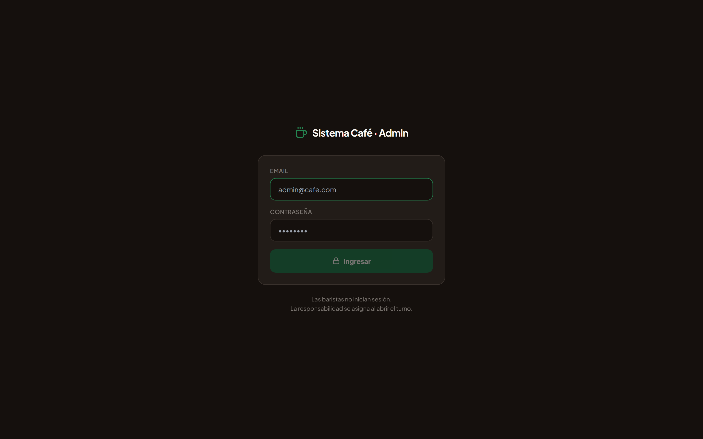

1. Abra la dirección del sistema en el navegador. Si está en el kiosko, toque el enlace **"Admin →"** para llegar a la pantalla de inicio de sesión.
2. Verá el título **"Sistema Café · Admin"** con dos campos: **Email** y **Contraseña**.
3. Escriba su correo de administrador y su contraseña.
4. Pulse **Ingresar**. El sistema lo lleva directo al **Dashboard**.
5. Si las credenciales son incorrectas aparece "Credenciales inválidas". Si intenta entrar con una cuenta que no es de administrador, verá "Esta pantalla es solo para administradores".

> **Nota importante:** las baristas **no** inician sesión. Bajo el modelo de responsabilidad colectiva, la responsabilidad se asigna al **abrir el turno** (se eligen las baristas) y el dispositivo corre en modo kiosko protegido por el **PIN de kiosko**. Por eso el login solo sirve para administradores.

### El menú lateral (sidebar)

Una vez adentro, a la izquierda tiene el menú lateral fijo con el logo **"Sistema Café"** arriba. Los ítems están agrupados por dominio:

- **Resumen:** Dashboard
- **Ventas:** Informe Contador · Informes · Notas crédito
- **Inventario:** Inventario · Lotes · Conciliación · Catálogo
- **Pedidos y compras:** Pedidos · Pagos proveedores
- **Caja:** Cuadres · Consignaciones
- **Operación:** Mantenimientos · Auditorías · Cumplimiento · Comunicados · Bandeja · Notificaciones
- **Registro:** Historial
- **Maestros:** Usuarios · Config ticket

Abajo del todo aparece su nombre, la etiqueta de rol (**admin**), la **campana** de notificaciones y el enlace **Cerrar sesión**.

- En pantallas grandes (computador) el menú está siempre visible a la izquierda.
- En celular o pantallas angostas, el menú se oculta: pulse el ícono de **menú (☰)** en la barra superior para abrirlo como cajón lateral.
- La **campana** muestra las notificaciones de su sede (con un número rojo si hay sin leer). Ábrala para ver la lista; puede marcar una como leída tocándola o usar **"Marcar todas"**.

### El selector de sede

La mayoría de las pantallas trabajan **por sede** (por tienda). Por eso casi todas muestran, cerca del título, un **selector de sede**: unos botones tipo "chip" con el nombre de cada sede (por ejemplo, *Vida* y *Palmetto*), o un menú desplegable. Algunas pantallas incluyen además el botón **"Todas"** para ver el consolidado de todas las sedes.

- El selector **solo aparece si su negocio tiene más de una sede**. Con una sola sede, el sistema la usa automáticamente.
- Cambiar de sede **actualiza toda la pantalla** con los datos de esa sede.
- Algunas pantallas (Cumplimiento, Notificaciones, Config ticket) trabajan con **la sede asignada a su usuario** y no tienen selector: si su cuenta no tiene una sede asignada, esas pantallas se lo indicarán. La sede de su cuenta se asigna en **Usuarios**.

---

## 1. Dashboard

**Para qué sirve:** es su tablero gerencial en una sola página. Reúne el pulso del día, las alertas que requieren su atención y el análisis del negocio, con posibilidad de filtrar por sede y por período.

**Cómo llegar:** Resumen → Dashboard (es la pantalla que ve al iniciar sesión).

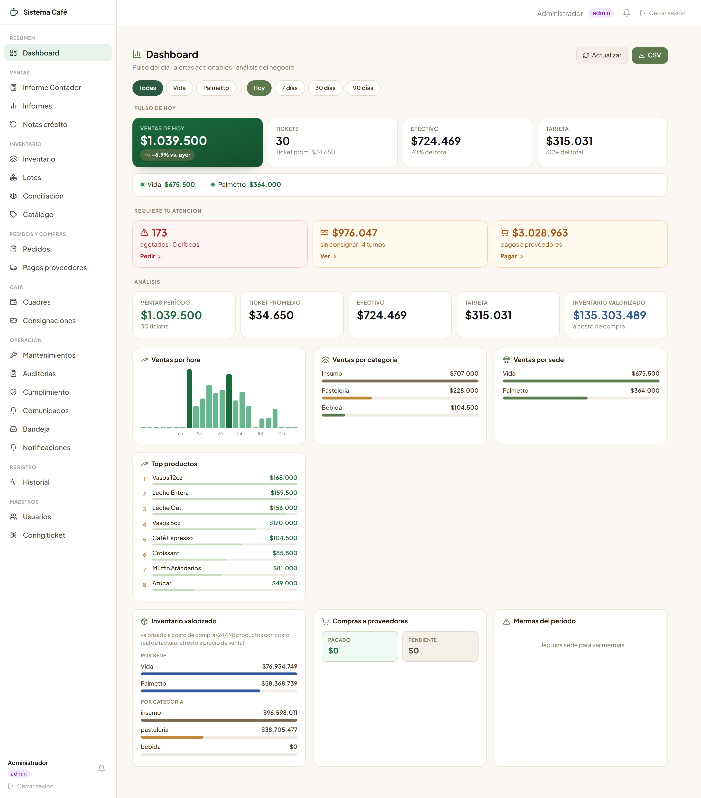

El Dashboard tiene tres bandas apiladas:

- **Banda 1 · Pulso de hoy:** ventas de hoy (con la variación % respecto a ayer), número de tickets con ticket promedio, efectivo y tarjeta, y una fila con el desglose de ventas de hoy **por sede** (un punto verde indica que la sede tiene turno abierto).
- **Banda 2 · Requiere tu atención:** tarjetas de alerta accionables (solo aparecen las que tienen algo pendiente). Si todo está en orden, muestra "Todo en orden — sin alertas activas".
- **Banda 3 · Análisis:** KPIs del período, ventas por hora, por categoría, por sede, top de productos, inventario valorizado, compras a proveedores y mermas.

### Cómo filtrar por sede

1. En la fila de filtros (arriba), use los chips de sede. **Todas** muestra el consolidado; cada chip filtra a una sede.
2. El filtro de sede afecta a las **tres bandas** (con una salvedad: el desglose de ventas de hoy por sede siempre muestra todas las sedes).

### Cómo cambiar el período de análisis

1. A la derecha de los chips de sede están los botones de período: **Hoy · 7 días · 30 días · 90 días**.
2. El período afecta **solo a la Banda 3 (Análisis)**. Las bandas 1 y 2 siempre reflejan "hoy" y "ahora".

### Cómo actualizar y exportar

1. Arriba a la derecha, pulse **Actualizar** para recargar todos los datos (mientras carga dice "Cargando…").
2. Pulse **CSV** para descargar un archivo con el resumen del análisis (KPIs, ventas por sede/categoría, top productos, indicadores de atención y mermas del período).

### Cómo usar las tarjetas de alerta (Banda 2)

Cada tarjeta es un botón que lo lleva directo a la pantalla donde se resuelve:

1. **Agotados / críticos** (ej. "173 · agotados · críticos", botón "Pedir") → abre **Pedidos**.
2. **Sin consignar** (monto pendiente, botón "Ver") → abre **Consignaciones**.
3. **Pagos a proveedores** (monto pendiente, botón "Pagar") → abre **Pagos proveedores**.
4. **Descuadres de caja del mes** (botón "Revisar") → abre **Informes**.
5. **Lotes por vencer** (botón "Ver") → abre **Lotes**.

### Cómo ver las mermas del período

1. En la Banda 3, el widget **"Mermas del período"** requiere elegir una sede: mientras esté en **"Todas"** mostrará "Elegí una sede para ver mermas".
2. Seleccione una sede en los chips de arriba para ver las mermas listadas (producto y unidades).

**Notas:** el widget "Ventas por sede" respeta el filtro de sede; los widgets "Inventario valorizado" y "Compras a proveedores" muestran el desglose por sede y por proveedor.

---

## 2. Informe Contador

**Para qué sirve:** genera el consolidado mensual de ventas día por día, pensado para entregar al contador.

**Cómo llegar:** Ventas → Informe Contador.

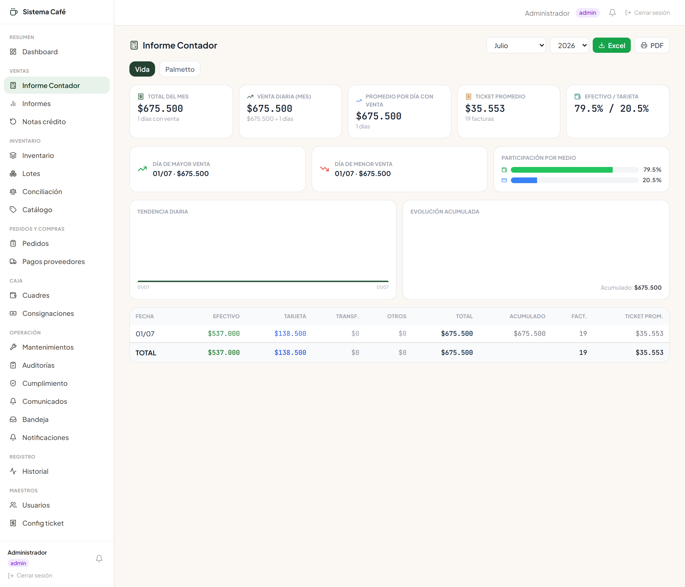

La pantalla muestra los KPIs del mes (**Total del mes**, **Venta diaria (mes)**, **Promedio por día con venta**, **Ticket promedio**, participación **Efectivo / Tarjeta**), el **día de mayor** y **menor** venta, un gráfico de **Tendencia diaria** y de **Evolución acumulada**, y una **tabla diaria** con columnas Efectivo, Tarjeta, Transferencia, Otros, Total, Acumulado, Facturas (Fact.) y Ticket promedio, con la fila **TOTAL** al pie.

### Cómo elegir el mes y el año

1. Arriba a la derecha, elija el **mes** en el primer desplegable (Enero … Diciembre).
2. Elija el **año** en el segundo desplegable (los últimos 5 años).
3. La pantalla se actualiza sola. Si no hubo ventas, verá "No hay ventas en {mes} {año} para esta sede".

### Cómo cambiar de sede

1. Debajo del título están los chips de sede.
2. Toque la sede deseada para recalcular todo el informe.

### Cómo exportar a Excel

1. Pulse **Excel**. Se descarga un archivo CSV (separado por `;`) que Excel abre directamente, con una fila por día y la fila TOTAL.

### Cómo imprimir o guardar en PDF

1. Pulse **PDF**. Se abre el cuadro de impresión del navegador.
2. Elija su impresora o "Guardar como PDF". La versión impresa incluye el título con el mes, el año y la sede.

---

## 3. Informes

**Para qué sirve:** es el centro de reportes de ventas y movimientos. Reúne tres vistas en pestañas: **Analítica**, **Ventas** (historial de tickets) y **Movimientos** de inventario.

**Cómo llegar:** Ventas → Informes.

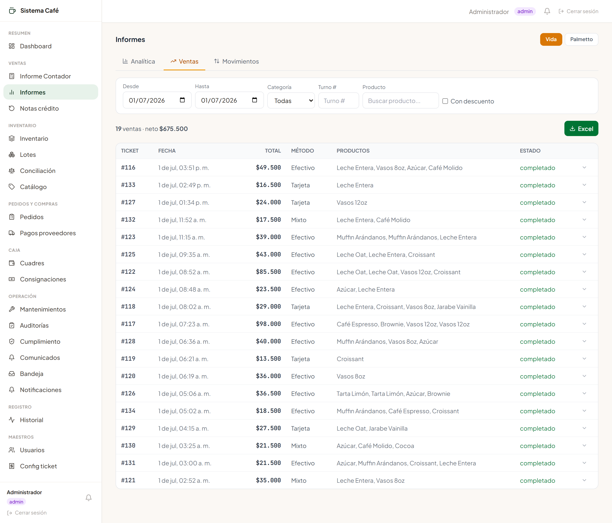

### Acciones comunes a las tres pestañas

1. **Cambiar de sede:** con los chips de sede arriba a la derecha.
2. **Alternar pestañas:** pulse **Analítica**, **Ventas** o **Movimientos**.
3. **Barra de filtros:** debajo de las pestañas hay una barra con **Desde**, **Hasta**, **Categoría** (Todas / Bebida / Pastelería / Insumo), **Turno #**, **Producto** (búsqueda) y una casilla **Con descuento**. Los filtros activos aparecen como etiquetas; **Limpiar filtros** los quita todos de una vez.

### Pestaña Analítica

Muestra KPIs (**Total ventas**, **Tickets** con ítems, **Ticket promedio**, **% Efectivo**), un resumen de **método de pago**, un **mapa de calor de ventas por hora** del día, el **Top de productos** y una tabla **Por barista** (con su ticket promedio, ATV).

1. Elija el rango con los botones rápidos **Hoy · Esta semana · Este mes**, o pulse **Rango** para elegir fechas personalizadas (aparecen los campos **Desde** y **Hasta**).
2. Pase el cursor sobre cada celda del mapa de calor para ver el monto y el número de tickets de esa hora.

### Pestaña Ventas (historial de tickets)

Es el historial real de tickets del período.

1. Ajuste el período en la barra de filtros. Arriba verá el total de ventas y el neto.
2. **Ver el detalle de un ticket:** haga clic en la fila. Se despliega el detalle con los ítems, el descuento (si hubo), y el desglose de pago (por ejemplo "Efectivo / Tarjeta" en pagos mixtos, o "Recibido / Cambio" en efectivo).
3. **Reimprimir o descargar un ticket:** dentro del detalle, pulse **Descargar / Imprimir** (abre el cuadro de impresión con el recibo).
4. **Exportar a Excel:** pulse **Excel** para bajar la lista de tickets del período.

### Pestaña Movimientos (de inventario)

Lista los movimientos de stock del período (entradas, mermas, ajustes, pastelería).

1. Pulse **Consultar** para traer los movimientos del período elegido.
2. Filtre por tipo con los chips: **Todos**, **Entradas**, **Mermas**, **Ajustes**, **Pastelería** (cada chip muestra su conteo entre paréntesis; solo aparecen los tipos con datos).
3. Pulse **Excel** para exportar la lista filtrada.

---

## 4. Notas crédito

**Para qué sirve:** revertir una venta ya completada (nota de crédito). Devuelve siempre el dinero y, producto por producto, usted decide si vuelve al inventario o no.

**Cómo llegar:** Ventas → Notas crédito.

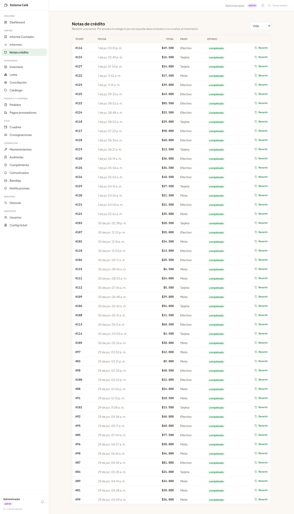

La pantalla lista los tickets recientes con su número, fecha, total, método de pago y estado. Solo los tickets en estado **completado** se pueden revertir.

### Cómo cambiar de sede

1. Use el desplegable de sede arriba a la derecha.

### Cómo revertir una venta

1. Ubique el ticket en estado **completado** y pulse **Revertir** (en su fila). Se abre el modal "Revertir venta #… ".
2. Escriba el **Motivo de la reversión** (es **obligatorio**).
3. Para **cada producto** del ticket, elija:
   - **Sí, se usó** → el producto **no** regresa al inventario (queda descontado).
   - **No, vuelve** → el producto **regresa** al stock.
   Por defecto todos quedan en "Sí, se usó".
4. Pulse **Confirmar Nota Crédito**.

**Nota:** el dinero se devuelve siempre; el inventario **solo** recupera lo que marcó como "No, vuelve". Los tickets ya reversados o anulados no muestran el botón Revertir.

---

## 5. Inventario (Control de inventario)

**Para qué sirve:** es la gestión operativa del stock. Tiene dos modos: **Stock** (semáforo de reposición y calibración de umbrales por producto) y **Rotación** (análisis de movimiento en un período).

**Cómo llegar:** Inventario → Inventario. (El ítem del menú se llama "Inventario" y abre la pantalla **Control de inventario**.)

### Acciones generales

1. **Cambiar de sede:** con los chips de sede arriba a la derecha.
2. **Alternar modo:** use el conmutador **Stock / Rotación**.

### Modo Stock

Arriba muestra los KPIs por estado: **Urgente**, **Pedir hoy**, **Stock bajo** y **OK**. Cada producto se muestra con un punto de color según su estado, una barra de nivel (stock actual / ideal) y los días restantes estimados. Si una barista alertó un producto, aparece la etiqueta **"🔔 barista"**.

1. **Buscar:** escriba en el campo de búsqueda para filtrar por nombre.
2. **Filtrar por categoría:** use los chips de categoría (Todas y las categorías detectadas).
3. **Registrar un ajuste de stock:** haga clic en la fila del producto para expandirla. En **"Ajuste de stock"** escriba la **Cantidad real en bodega** y, opcionalmente, un **Motivo** (ej. "Conteo físico"); pulse **Confirmar**. El sistema fija el stock a esa cantidad real.
4. **Calibrar umbrales y tiempo de entrega:** en la misma fila expandida, en **"Umbrales y tiempo de entrega"**, ajuste **Crítico**, **Mínimo**, **Ideal** (en la unidad del producto) y **Entrega (días)**; pulse **Guardar umbrales**. Estos valores determinan cuándo el producto pasa a Urgente/Pedir/Bajo/OK.

### Modo Rotación

1. Elija el rango con **Desde** y **Hasta** (por defecto, los últimos 30 días).
2. Verá tarjetas-resumen: **Activos**, **Estancados**, **Sin movimiento** y **Bajo mínimo**. **Toque una tarjeta** para filtrar la tabla por ese estado (vuelva a tocarla para quitar el filtro).
3. La tabla muestra por producto: stock, entradas, salidas, la rotación (por ejemplo "3x") y su estado.
4. Pulse **Excel** para exportar la tabla de rotación.

---

## 6. Lotes

**Para qué sirve:** trazabilidad de los lotes de entrada (proveedor, factura, vencimiento y consumo), con alerta de vencimientos.

**Cómo llegar:** Inventario → Lotes.

Cada lote se muestra como una tarjeta con el producto, el proveedor, el número de lote y la sede; las fechas de entrada y vencimiento; y una barra con el porcentaje consumido y la cantidad restante/inicial. Si hay lotes por vencer o vencidos, aparece un aviso arriba (ej. "3 por vencer / vencidos").

### Cómo filtrar y buscar

1. **Sede:** use **Todas** o el chip de una sede.
2. **Buscar:** escriba en el campo para buscar por producto, número de lote o proveedor.
3. **Proveedor:** elija uno en el desplegable "Todos los proveedores".
4. **Estado:** elija en el desplegable **Todo estado / Activos / Por vencer / Vencidos / Agotados**.

### Cómo exportar

1. Pulse **CSV** para descargar los lotes actualmente filtrados (producto, sede, proveedor, lote, estado, cantidades, fechas y % consumido).

---

## 7. Conciliación

**Para qué sirve:** comparar el stock **teórico** (el que dice el sistema) contra el **conteo físico** mensual y valorizar los faltantes y sobrantes en dinero.

**Cómo llegar:** Inventario → Conciliación.

**Requisitos / datos necesarios:** requiere un **conteo mensual cerrado** para el mes y la sede elegidos. Si no existe, verá "No hay conteo mensual cerrado…". Si el conteo está **en proceso** (no cerrado), la pantalla lo advierte y los valores aún no se calculan. (El conteo mensual lo realizan y cierran las baristas desde el POS.)

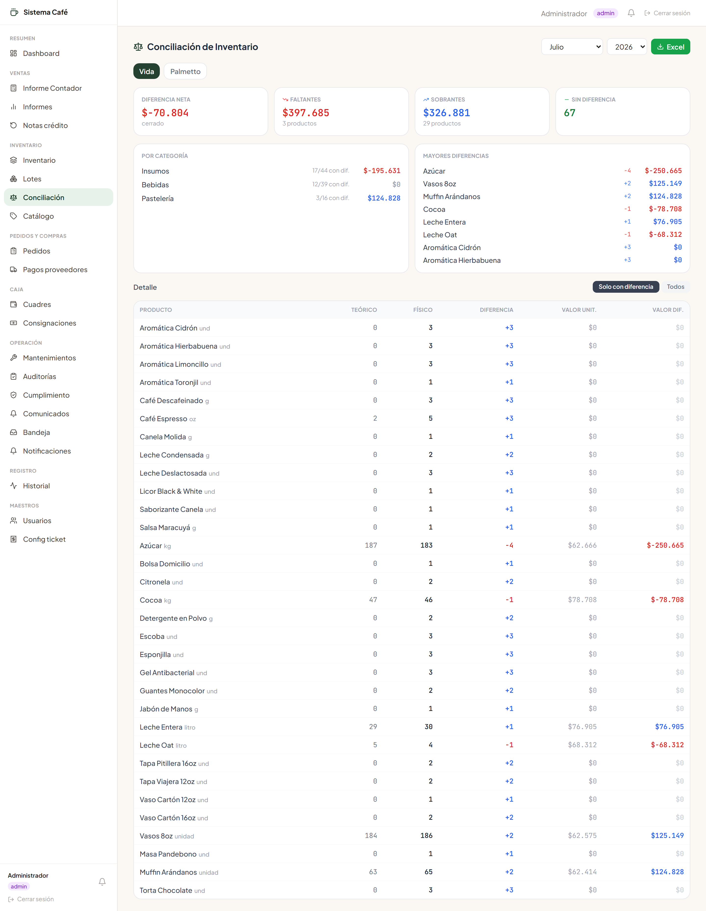

Cuando hay un conteo cerrado, muestra KPIs (**Diferencia neta**, **Faltantes**, **Sobrantes**, **Sin diferencia**), un resumen **por categoría**, el ranking de **mayores diferencias** y la **tabla de detalle** por producto (Teórico, Físico, Diferencia, Valor unitario, Valor de la diferencia).

### Cómo elegir el mes, el año y la sede

1. Elija **mes** y **año** en los desplegables de arriba a la derecha.
2. Cambie de sede con los chips debajo del título.

### Cómo alternar la vista de detalle

1. En la sección **Detalle**, use **Solo con diferencia** (por defecto) o **Todos** para incluir también los productos sin diferencia.

### Cómo exportar

1. Pulse **Excel** para descargar el detalle completo (CSV separado por `;`).

---

## 8. Catálogo

**Para qué sirve:** es el maestro de productos multi-sede. Aquí crea, edita y elimina productos, define el **precio de venta del POS**, ajusta el **stock mínimo por sede**, decide si un producto **entra en el conteo** y detecta **duplicados**.

**Cómo llegar:** Inventario → Catálogo.

Los productos se agrupan por categoría (**Pastelería**, **Bebidas / Café**, **Porciones**, **Insumos / Desechables**). Cada fila muestra el producto, su unidad, el stock por sede con su mínimo, el **Precio POS**, el conmutador **Conteo** y el lápiz para editar. Arriba, si hay alertas de stock, aparece un contador de alertas.

### Cómo crear un producto nuevo

1. Pulse **Nuevo producto**.
2. Complete: **Nombre**, **Categoría** (Pastelería / Bebidas / Porciones / Insumos), **Unidad** (und, g, kg, litro, ml, porción, paq) y la casilla **Controla stock** (déjela marcada si el producto lleva inventario).
3. Pulse **Guardar** (o **Cancelar** para descartar).

### Cómo filtrar y buscar

1. **Categoría:** use los chips de categoría (o **Todas**).
2. **Buscar:** escriba en el campo "Buscar…" arriba a la derecha.

### Cómo editar el nombre o la unidad de un producto

1. Pulse el **lápiz** en la fila del producto.
2. Cambie el nombre o la unidad y confirme con el **check** (o cancele con la **X**).

### Cómo fijar o cambiar el precio de venta del POS

1. En la columna **Precio POS**, pulse el valor (o "Sin precio").
2. Escriba el nuevo precio y pulse **Enter** o el **check** para guardar (Escape o la **X** cancela). Un producto sin precio de venta no se vende en el POS.

### Cómo editar el stock mínimo por sede

1. Debajo del stock de una sede, pulse **"mín …"**.
2. Escriba el nuevo mínimo y pulse **Enter** o el **check**.

### Cómo incluir o excluir un producto del conteo

1. Use el conmutador **Conteo** en la fila del producto. Verde = se incluye en el conteo mensual; gris = se excluye.

### Cómo detectar y eliminar duplicados

1. Pulse **Duplicados** (muestra un contador si hay grupos repetidos).
2. El sistema agrupa los productos cuyo nombre normalizado es igual y los muestra con su ID, categoría, unidad, precio y stock por sede.
3. Para borrar un registro repetido, pulse el ícono de **papelera** en su fila y confirme con **Sí**.

**Nota:** un producto **solo** se puede eliminar desde la vista **Duplicados**, y **falla si tiene historial de movimientos** ("No se puede eliminar: tiene historial de movimientos"). En ese caso, conviene dejarlo y unificar hacia el registro correcto.

---

## 9. Pedidos

**Para qué sirve:** armar los pedidos de reposición sugeridos por proveedor, aprobar los conteos de compras hechos por las baristas y asignar proveedores a los productos.

**Cómo llegar:** Pedidos y compras → Pedidos.

### Acciones generales

1. **Cambiar de sede:** con los chips de sede.
2. **Alternar pestañas:** **Sugerencia**, **Conteos** (muestra un número si hay conteos pendientes) y **Proveedores**.

### Pestaña Sugerencia

Arriba muestra los KPIs **Urgente / Pedir hoy / Stock bajo / OK**. Los productos se agrupan por **proveedor fijo** y por **insumos generales**.

1. Expanda un grupo de proveedor para ver sus productos, el stock actual, los días restantes y la cantidad a pedir.
2. **Ajuste la cantidad a pedir** de cada producto en su casilla (el sistema propone un valor sugerido).
3. En "Insumos generales", use **"Ver … productos OK"** / **"Ocultar OK"** para mostrar u ocultar los que ya tienen stock suficiente.
4. Pulse **Copiar lista para WhatsApp** en un grupo de proveedor: copia al portapapeles el pedido con formato listo para enviar (solo incluye los productos con cantidad mayor a cero).

### Pestaña Conteos

Lista los conteos de compras que las baristas dejaron pendientes de aprobar.

1. Expanda un conteo para ver, producto por producto, la cantidad del **sistema** frente a la **real** contada y su diferencia.
2. Pulse **Aprobar y Ajustar Stock** para actualizar el inventario a las cantidades reales contadas.

### Pestaña Proveedores

Sirve para asignar un proveedor a cada producto (así aparece agrupado en la sugerencia de pedido).

1. **Buscar:** escriba el nombre del producto.
2. En cada producto, escriba o elija el **proveedor** (hay autocompletado con los proveedores existentes).
3. Pulse el botón de **guardar** (check) del producto para confirmar. Deje el campo **vacío** para mover el producto a "Insumos generales".

---

## 10. Pagos proveedores

**Para qué sirve:** son sus cuentas por pagar. Muestra las facturas recibidas, su estado de pago y le permite **registrar pagos** con soporte.

**Cómo llegar:** Pedidos y compras → Pagos proveedores.

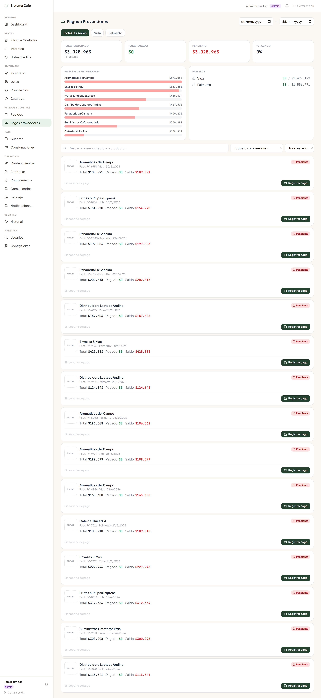

Muestra KPIs (**Total facturado**, **Total pagado**, **Pendiente**, **% Pagado**), un **ranking de proveedores**, el desglose **por sede** y la **lista de facturas** con la foto de la factura, el proveedor, el número, la sede, la fecha y los montos (Total, Pagado, Saldo) con su estado (**Pagado / Parcial / Pendiente**).

### Cómo filtrar

1. **Rango de fechas:** use los campos de fecha arriba a la derecha (Desde → Hasta).
2. **Sede:** use **Todas las sedes** o el chip de una sede.
3. **Buscar:** por proveedor, número de factura o producto.
4. **Proveedor** y **Estado:** con los desplegables (Todo estado / Pagado / Parcial / Pendiente).

### Cómo ver y descargar la factura y el soporte

1. Toque la **miniatura** de la factura para abrirla ampliada.
2. Use el enlace **Factura** para descargar la imagen de la factura.
3. Use **Soporte de pago** para descargar el comprobante del pago (si ya se registró).

### Cómo registrar un pago

1. En una factura que no esté totalmente pagada, pulse **Registrar pago**. Se abre el modal con el saldo pendiente.
2. Confirme o ajuste el **Monto a pagar** (viene precargado con el saldo).
3. Elija la **Forma de pago**:
   - **Efectivo (sale del cajón)** — descuenta del efectivo de caja.
   - **Bancos** — transferencia bancaria.
   - **Cheque**.
   - **Otro**.
4. Opcionalmente, adjunte la **Foto del soporte** con **Adjuntar comprobante**.
5. Pulse **Confirmar pago**. Si algo falla, el modal muestra el error para reintentar.

**Nota:** solo el pago en **Efectivo** afecta el cajón; las demás formas quedan como registro contable.

---

## 11. Cuadres

**Para qué sirve:** auditar los turnos de caja. Tiene dos modos: **Operacional** (tarjetas de turnos con su detalle, movimientos y foto del cuadre) e **Historial** (turnos y desempeño por barista, con exportación).

**Cómo llegar:** Caja → Cuadres.

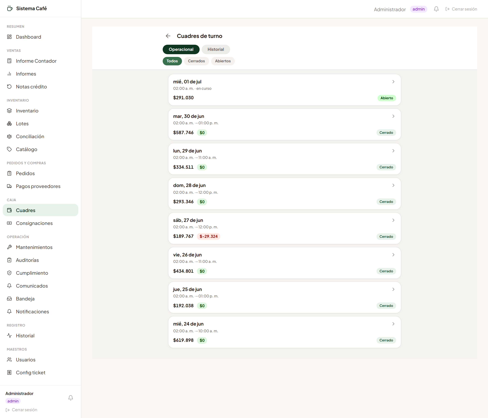

### Cómo alternar entre modos

1. Use los botones **Operacional** / **Historial** en la parte superior.

### Modo Operacional

1. Filtre con **Todos / Cerrados / Abiertos**.
2. Cada turno se muestra como tarjeta con la fecha, el horario, las baristas, el total de ventas, la diferencia de cierre y su estado (Abierto / Cerrado). Un ícono de cámara indica que tiene foto de cuadre.
3. **Abrir el detalle de un turno:** toque la tarjeta. Verá:
   - Las **baristas** del turno.
   - **Ventas del turno** (Total, Efectivo, Tarjeta Bold) y la diferencia de apertura si la hubo.
   - **Cuadre de cierre** (Efectivo contado, Diferencia de caja, Datáfono, Diferencia Bold) si el turno está cerrado.
   - La **foto del cuadre de caja**: tóquela para verla a tamaño completo.
   - **Movimientos de caja** (ingresos y egresos) con su concepto, fecha, monto y foto si la tienen.
4. Use la **flecha atrás** para volver a la lista.

> **Nota sobre la sede:** el modo Operacional muestra los turnos de **la sede asignada a su usuario**. Para revisar otra sede, use el modo **Historial**, que sí tiene selector de sede.

### Modo Historial

1. Si tiene varias sedes, **elija la sede** con los chips.
2. Fije el **rango de fechas** (Desde / Hasta).
3. Elija la sub-pestaña **Turnos** o **Baristas** y pulse **Consultar**.
4. **Turnos:** muestra los totales del período (Turnos, Ventas totales, Efectivo, Con diferencia) y la lista de turnos; expanda cada uno para ver base real, efectivo, tarjeta, diferencia Bold, quién cerró y la justificación.
5. **Baristas:** muestra el **ranking de desempeño** (llegadas, cierres, diferencias) y los **cuadres de llegada** con su efectivo esperado vs real, la diferencia y la foto.
6. Pulse **Excel** para exportar la vista actual (Turnos o Cuadres de barista).

---

## 12. Consignaciones

**Para qué sirve:** reconciliar el efectivo que cada turno **debe consignar** contra lo que realmente se **consignó**, confirmar consignaciones pendientes y revisar el flujo de caja por turno.

**Cómo llegar:** Caja → Consignaciones.

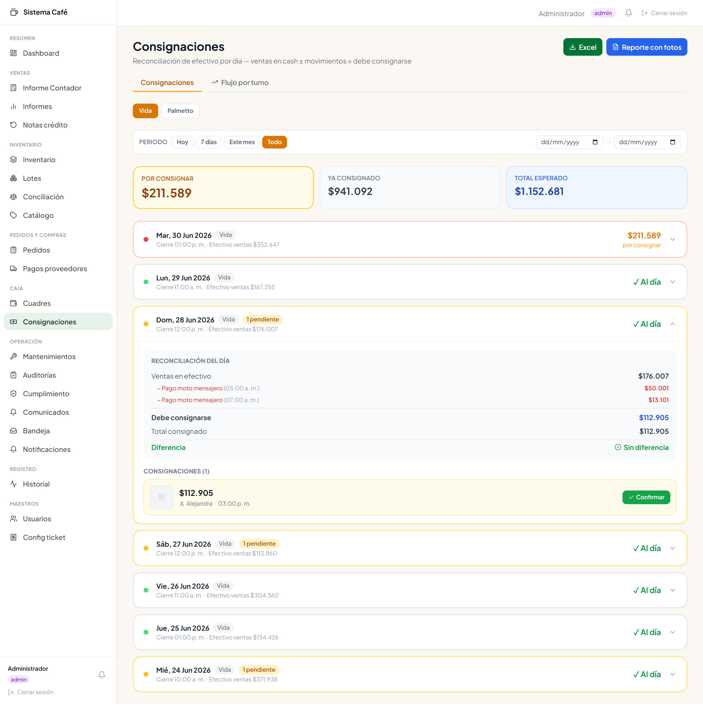

### Acciones generales

1. **Alternar pestañas:** **Consignaciones** y **Flujo por turno**.
2. **Cambiar de sede:** con los chips de sede (compartidos entre ambas pestañas).

### Pestaña Consignaciones

Arriba muestra el resumen global (**Por consignar**, **Ya consignado**, **Total esperado**) y luego una tarjeta por día.

1. **Elegir el período:** use los presets **Hoy · 7 días · Este mes · Todo**, o fije un rango con los campos de fecha (la **X** limpia el rango).
2. **Ver el detalle de un día:** toque la tarjeta del día. Se despliega la **reconciliación**: ventas en efectivo ± movimientos (ingresos/egresos) = **debe consignarse**, frente al **total consignado**, con la **diferencia** al final.
3. **Ver la foto de una consignación:** toque la miniatura para ampliarla.
4. **Confirmar una consignación pendiente:** en una consignación marcada como *pendiente*, pulse **Confirmar**. Pasa a "Confirmada".
5. **Exportar a Excel:** pulse **Excel** (incluye fecha, valor, barista, estado y el enlace de la foto).
6. **Reporte con fotos:** pulse **Reporte con fotos** para generar un archivo HTML imprimible (se abre en el navegador y puede guardarlo como PDF), con las fotos de cada consignación.

### Pestaña Flujo por turno

1. En **Seleccionar turno**, elija un turno cerrado de la lista.
2. Verá la **cascada de efectivo**: base de apertura, ventas (efectivo/tarjeta), movimientos de ingreso y egreso, consignaciones, **efectivo esperado**, efectivo final real y la **diferencia de cierre**.

---

## 13. Mantenimientos

**Para qué sirve:** llevar la bitácora de mantenimientos y reparaciones (equipos, fumigación, sondeo, plomería, eléctrico u otro), con costo, técnico y foto de soporte.

**Cómo llegar:** Operación → Mantenimientos.

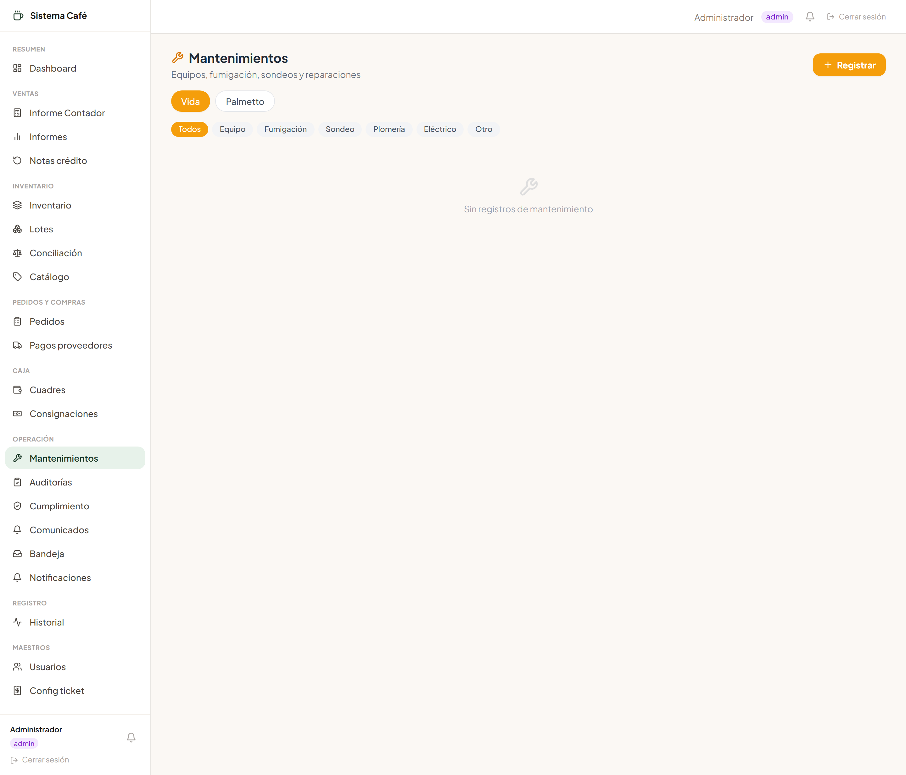

### Cómo cambiar de sede y filtrar

1. **Sede:** con los chips de sede.
2. **Filtrar por tipo:** con los chips **Todos / Equipo / Fumigación / Sondeo / Plomería / Eléctrico / Otro**.

### Cómo registrar un mantenimiento

1. Pulse **Registrar**.
2. Elija el **Tipo**.
3. Escriba la **Descripción del trabajo** (**obligatoria**) y, si desea, **Notas adicionales**.
4. Fije la **Fecha realizado** (**obligatoria**).
5. Opcionalmente, indique **Técnico / Empresa**, el **Costo** y adjunte una **Foto / Soporte**.
6. Pulse **Registrar mantenimiento**.

### Cómo ver el detalle y eliminar

1. Toque una tarjeta para expandirla y ver la descripción, el técnico y quién lo registró.
2. Si hay foto, pulse **Ver foto** para ampliarla.
3. Pulse **Eliminar** (pide confirmación) para borrar el registro.

---

## 14. Auditorías

**Para qué sirve:** dos controles en un mismo lugar: **Inventario** (auditorías de conteo con causa y cierre) y **Limpieza** (cronograma semanal de aseo con visto bueno).

**Cómo llegar:** Operación → Auditorías.

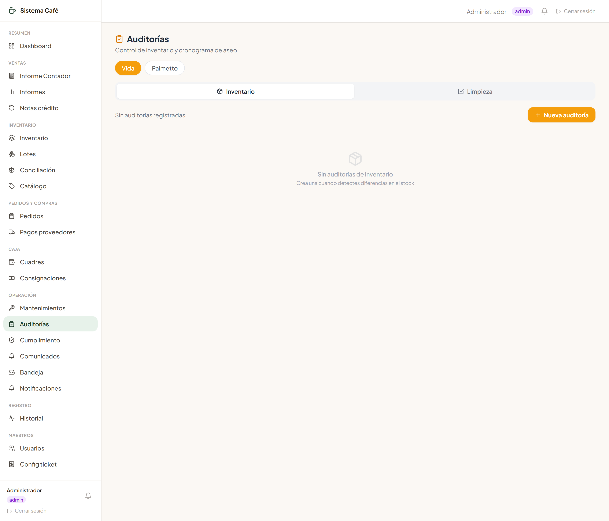

### Acciones generales

1. **Cambiar de sede:** con los chips de sede.
2. **Alternar pestañas:** **Inventario** / **Limpieza**.

### Pestaña Inventario

1. **Crear una auditoría:** pulse **Nueva auditoría**. Escriba el **Motivo / Descripción** (obligatorio); opcionalmente elija una **Causa** (Acceso no autorizado, Error de conteo, Daño al producto, Traslado no registrado, Otro) y agregue **Observaciones generales**. Busque los productos y escriba la **cantidad contada** de cada uno; pulse **Crear auditoría**.
2. **Ver una auditoría:** toque la tarjeta para expandirla y ver, producto por producto, el sistema vs lo real y la diferencia (faltantes en rojo, sobrantes en verde).
3. **Cerrar una auditoría:** en una auditoría *abierta*, pulse **Cerrar auditoría**, elija la **Causa** y escriba las **Acciones tomadas**; confirme el cierre.
4. **Eliminar:** pulse **Eliminar** (pide confirmación).

### Pestaña Limpieza

1. **Crear el cronograma de "Esta semana":** pulse **Esta semana**. Confirme la **Semana (ISO)** y agregue **Observaciones**; pulse **Crear cronograma**. (Solo se puede crear una vez por semana.)
2. **Trabajar una semana:** toque la tarjeta de la semana para abrirla. Marque las tareas realizadas, indique **quién** las hizo, agregue observaciones y pulse **Guardar cambios**.
3. **Dar el visto bueno (VoBo):** cuando el 100% de las tareas están completas, aparece el botón **VoBo**. Al darlo, la semana queda validada de forma **irreversible** (pide confirmación).
4. **Eliminar:** dentro del detalle, use **Eliminar cronograma** (pide confirmación).

---

## 15. Cumplimiento

**Para qué sirve:** ver la **frecuencia real** con que se ejecutaron las rutinas operativas (limpieza, surtido, vitrina) en los últimos 7 días, por rutina y por barista. Es una pantalla de **solo lectura**.

**Cómo llegar:** Operación → Cumplimiento.

**Requisitos / datos necesarios:** su cuenta de admin debe tener una **sede asignada** (si no, verá "Tu cuenta no tiene una sede asignada"). Los datos provienen de las rutinas que las baristas registran desde el **Panel de Turno del POS**; si no hay registros, la pantalla muestra "Sin datos aún" con la indicación de empezar a registrarlas desde el POS.

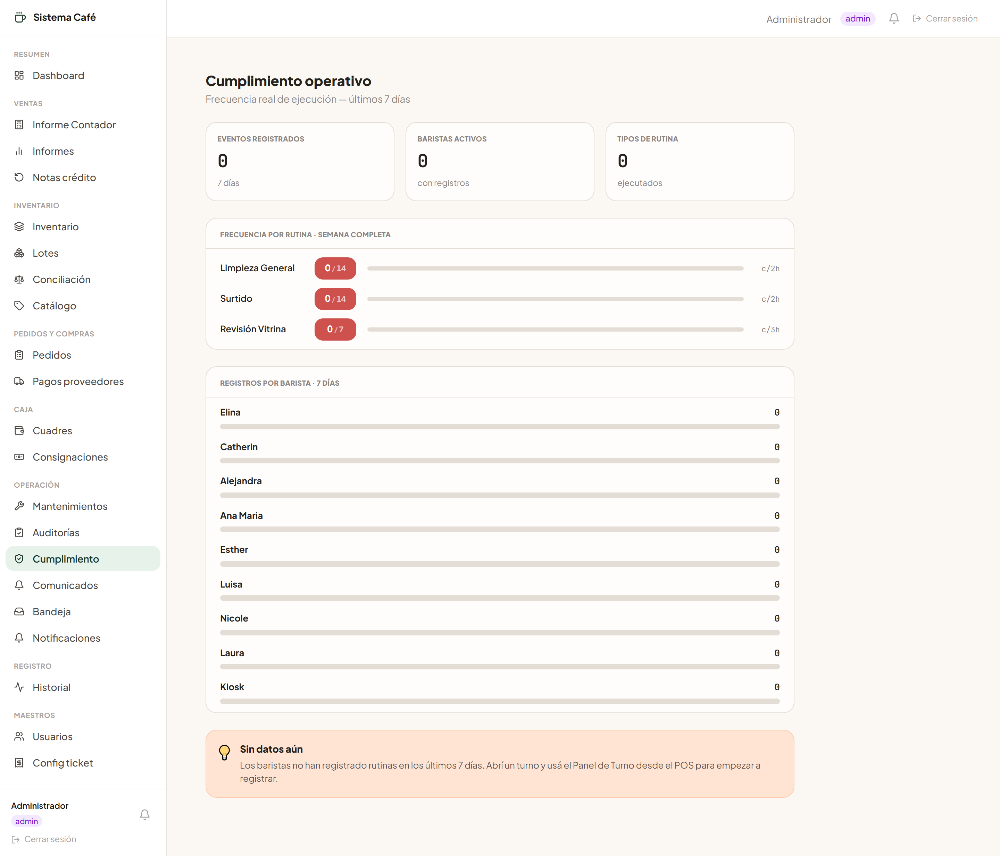

En la pantalla verá:

- KPIs: **Eventos registrados**, **Baristas activos** y **Tipos de rutina** ejecutados.
- **Frecuencia por rutina** (semana completa): cada rutina con lo ejecutado vs lo esperado (por ejemplo "0 / 14"), con barra de color y la frecuencia esperada (ej. "c/2h").
- **Registros por barista** en los últimos 7 días, con una barra por persona.

No hay acciones que realizar: es un panel informativo para supervisar la disciplina operativa.

---

## 16. Comunicados

**Para qué sirve:** publicar mensajes que las baristas ven al entrar al sistema, con opción de marcarlos como **urgentes** y de segmentarlos por tienda.

**Cómo llegar:** Operación → Comunicados.

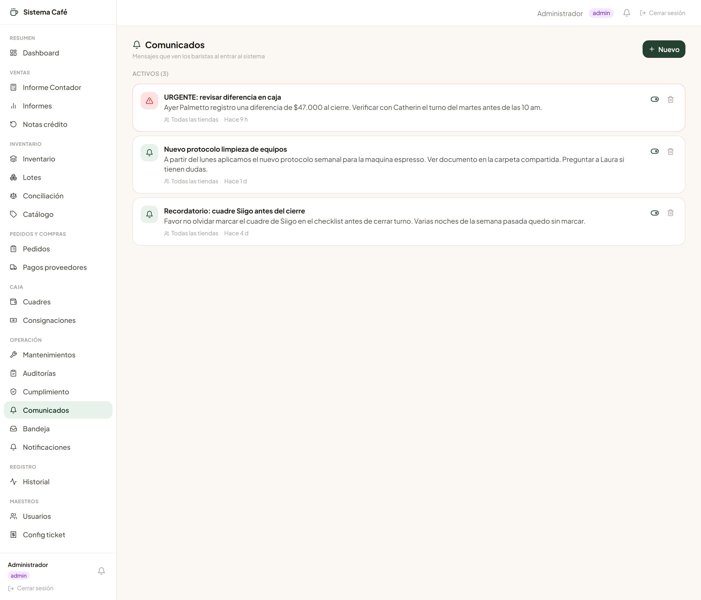

Los comunicados se separan en **Activos** e **Inactivos**. Cada tarjeta muestra el título, el mensaje, el destinatario (una tienda o "Todas las tiendas"), cuándo se creó y cuántas baristas lo leyeron.

### Cómo crear un comunicado

1. Pulse **Nuevo**.
2. Opcionalmente escriba un **Título**.
3. Escriba el **Mensaje** (**obligatorio**).
4. En **Para**, elija **Todas las tiendas** o una tienda específica.
5. Si es importante, active **Urgente**.
6. Pulse **Publicar**.

### Cómo activar/desactivar o eliminar

1. **Activar/desactivar:** use el conmutador de la tarjeta. Un comunicado inactivo deja de mostrarse a las baristas pero queda guardado.
2. **Eliminar:** pulse la **papelera** (pide confirmación).

---

## 17. Bandeja

**Para qué sirve:** aprobar o rechazar las solicitudes que hacen las baristas: **pedidos de insumos** y **solicitudes de sencilla** (cambio de billetes/monedas). Un contador indica cuántas hay pendientes.

**Cómo llegar:** Operación → Bandeja.

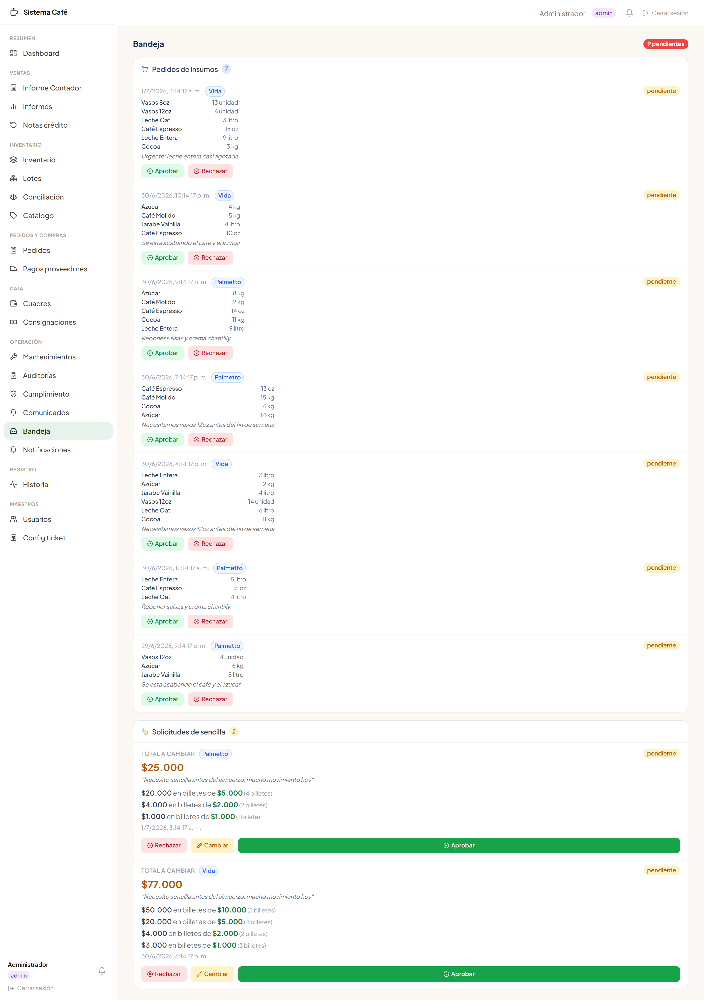

### Pedidos de insumos

1. Cada solicitud muestra la fecha, la tienda, los productos con su cantidad y la nota (si la hay).
2. Pulse **Aprobar** o **Rechazar** en la solicitud pendiente.

### Solicitudes de sencilla

Cada solicitud muestra el **total a cambiar**, el motivo y el desglose por denominaciones (billetes y monedas).

1. **Aprobar tal cual:** pulse **Aprobar**.
2. **Rechazar:** pulse **Rechazar**.
3. **Cambiar el detalle antes de aprobar:** pulse **Cambiar**. Se abre el editor de denominaciones: escriba el monto por cada denominación (debe ser **múltiplo** del valor; si no, marca "no válido"). El **total** se recalcula solo. Cuando esté correcto, pulse **Aprobar** con el detalle ajustado.

---

## 18. Notificaciones

**Para qué sirve:** configurar el motor de reglas de alertas (por **campana** y por **push** al celular) y administrar el push web (PWA) de este dispositivo.

**Cómo llegar:** Operación → Notificaciones.

**Requisitos / datos necesarios:** su cuenta debe tener una **sede asignada**. El push al celular requiere un navegador compatible y que el servidor tenga configurada la clave técnica de push (**VAPID_PRIVATE_KEY**); si falta, la prueba de push avisará "Push no configurado en el servidor".

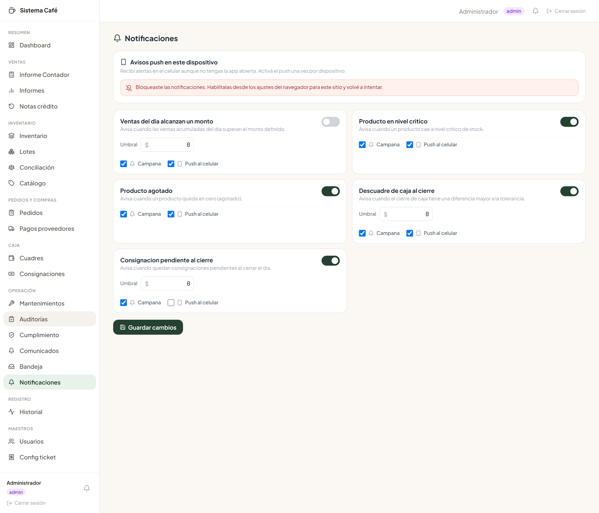

### Cómo activar el push en este dispositivo

1. En la tarjeta **"Avisos push en este dispositivo"**, pulse **Activar push en este dispositivo** y acepte el permiso del navegador.
2. Con el push activo, aparece **Enviar prueba** (para verificar que llega el aviso) y **Desactivar**.
3. En iPhone, primero debe **instalar la app** en la pantalla de inicio (Compartir → "Agregar a inicio") y abrirla desde ahí; si el navegador no soporta push, la pantalla lo indica.

### Cómo configurar las reglas de alerta

1. Cada regla (por ejemplo: ventas del día alcanzan un monto, producto en nivel crítico, producto agotado, descuadre de caja al cierre, consignación pendiente al cierre) tiene un **conmutador** para activarla o desactivarla.
2. En las reglas cuya unidad es dinero (**$**), edite el **Umbral** en el campo correspondiente.
3. Elija los **canales**: **Campana** (avisos dentro del sistema) y/o **Push al celular**.
4. Pulse **Guardar cambios**. Aparece "Cambios guardados" al confirmar.

---

## 19. Historial

**Para qué sirve:** es el registro de auditoría de todas las operaciones del sistema (aperturas y cierres de caja, ventas, ajustes de inventario, mermas, facturas, entregas, cuadres, etc.), con los datos "antes" y "después" de cada cambio.

**Cómo llegar:** Registro → Historial.

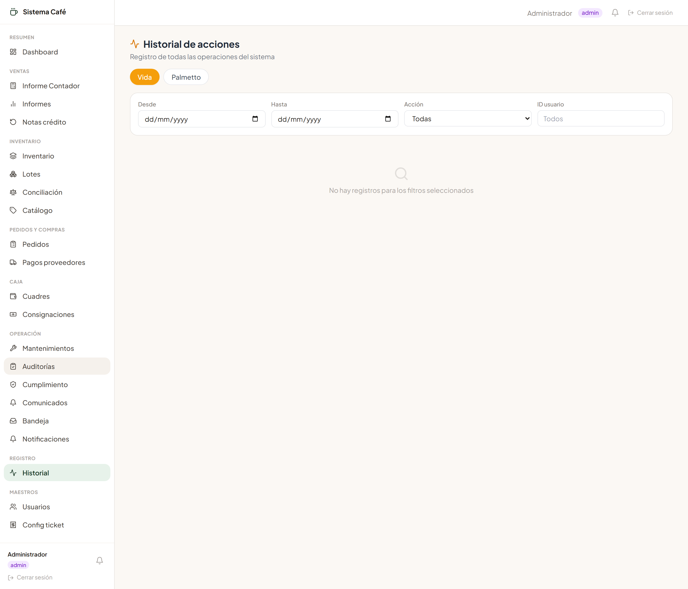

Muestra los **últimos 100** registros del período: fecha, tipo de acción (con etiqueta de color), usuario y la tabla/registro afectado.

### Cómo filtrar

1. **Sede:** con los chips de sede.
2. **Desde / Hasta:** fije el rango de fechas.
3. **Acción:** elija un tipo en el desplegable (Apertura caja, Cierre caja, Venta, Inventario, Merma, Factura, Compra, Entrega, Cuadre llegada) o **Todas**.
4. **ID usuario:** escriba el identificador numérico de un usuario para ver solo sus acciones.
5. Use **Limpiar filtros** para quitarlos todos.

### Cómo ver el detalle de una operación

1. Haga clic en una fila para expandirla. Verá los datos **Antes** y **Después** en formato técnico (JSON), útil para verificar qué cambió exactamente.

---

## 20. Usuarios

**Para qué sirve:** administrar los usuarios (baristas y administradores), las contraseñas de los administradores y el **PIN del kiosko**.

**Cómo llegar:** Maestros → Usuarios.

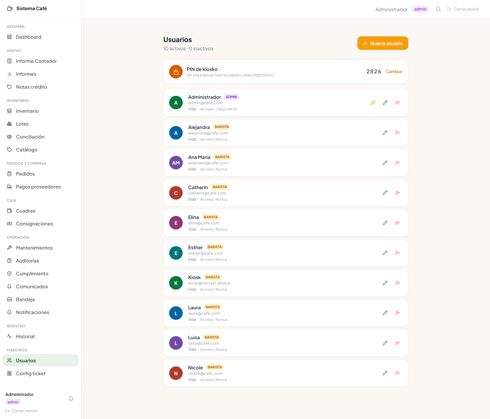

Arriba aparece la tarjeta del **PIN de kiosko** y debajo la lista de usuarios (activos e inactivos), cada uno con su rol (**admin** / **barista**), correo, sede y último acceso.

### Cómo ver o cambiar el PIN de kiosko

1. En la tarjeta **PIN de kiosko** se muestra el PIN actual.
2. Pulse **Cambiar**, escriba el **Nuevo PIN** (mínimo 4 caracteres) y pulse **Guardar**. Aparece "PIN actualizado".

> El PIN de kiosko es el que las baristas usan para **activar la caja en cada dispositivo**.

### Cómo agregar un usuario

1. Pulse **Nuevo usuario**.
2. Escriba el **Nombre**.
3. Elija el **Rol**: **Barista** o **Admin**.
4. Elija la **Sede** (o "Sin sede").
5. Si el rol es **Admin**, complete además el **Email** (para iniciar sesión) y la **Contraseña** (mínimo 6 caracteres).
6. Pulse **Crear usuario**.

> Las **baristas no inician sesión**: con el nombre alcanza para que aparezcan al abrir un turno. Los **admins** sí necesitan email y contraseña.

### Cómo editar un usuario

1. Pulse el **lápiz** en su fila.
2. Puede cambiar el **Nombre**, el **Rol** y la **Sede**. Pulse **Guardar cambios**.

### Cómo cambiar la contraseña de un administrador

1. En la fila de un usuario **admin**, pulse el ícono de **llave**.
2. Escriba la nueva **Contraseña** (mínimo 6 caracteres) y pulse **Cambiar contraseña**.

### Cómo desactivar o reactivar un usuario

1. **Desactivar:** pulse el ícono de usuario tachado en su fila. El usuario pasa a la sección "Inactivos".
2. **Reactivar:** en un usuario inactivo, pulse el ícono de usuario con check.

---

## 21. Config ticket

**Para qué sirve:** configurar los datos y el formato del comprobante impreso (el ticket de venta) **por sede**.

**Cómo llegar:** Maestros → Config ticket.

**Requisitos / datos necesarios:** su cuenta de admin debe tener una **sede asignada** (la configuración es por sede). Si no la tiene, la pantalla lo advierte y le pide asignar una sede en **Usuarios**.

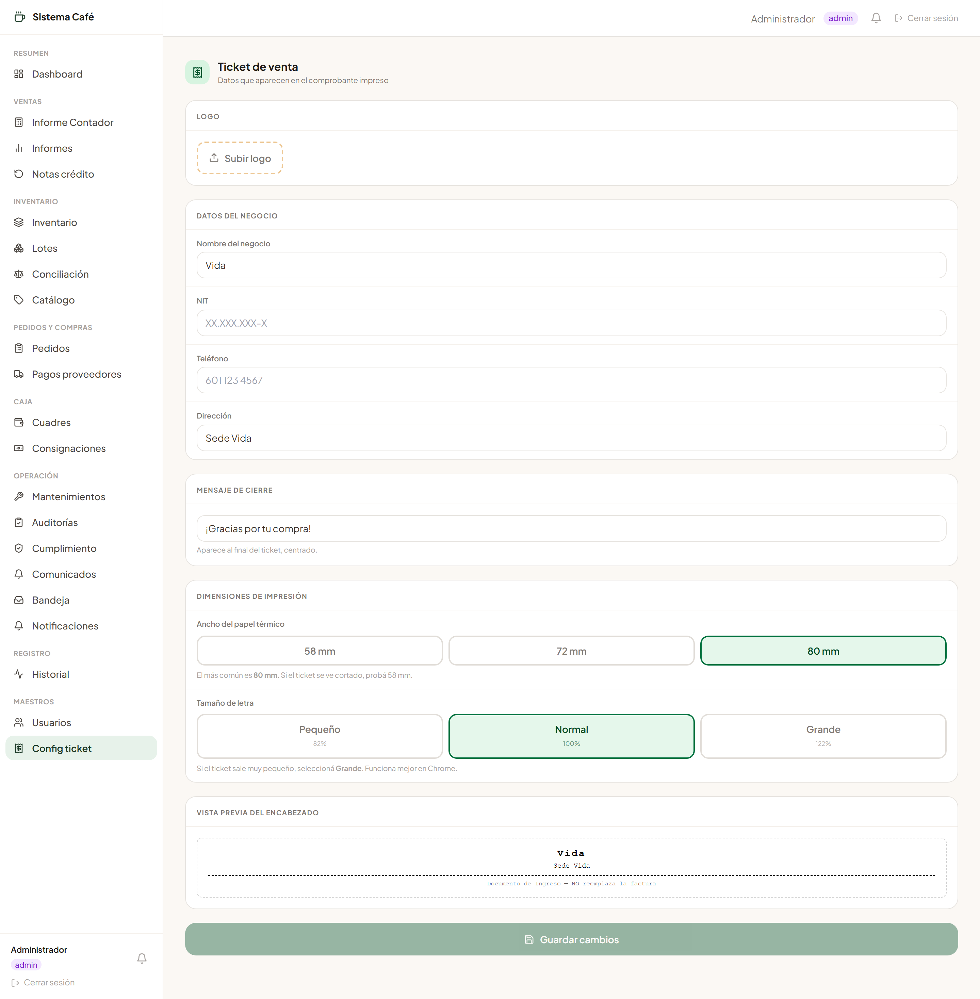

La pantalla incluye una **vista previa del encabezado** que se actualiza a medida que edita.

### Cómo cambiar el logo

1. En **Logo**, pulse **Subir logo** (o **Cambiar** si ya hay uno) y elija la imagen.
2. Para quitarlo, pulse **Eliminar**. El logo se imprime centrado en la parte superior del ticket.

### Cómo editar los datos del negocio

1. En **Datos del negocio**, complete **Nombre del negocio**, **NIT**, **Teléfono** y **Dirección**.

### Cómo editar el mensaje de cierre

1. En **Mensaje de cierre**, escriba el texto del pie del ticket (por ejemplo, "¡Gracias por tu compra!"). Aparece centrado al final.

### Cómo elegir el ancho del papel, el margen y el tamaño de letra

1. En **Dimensiones de impresión**, elija el **Ancho del papel térmico**: **58 / 72 / 80 mm** (el más común es 80 mm; si el ticket sale cortado, pruebe 58 mm).
2. Elija el **Margen lateral (mm)**: de **0 a 5 mm**. Es el espacio en blanco a los lados del ticket. **Si el contenido se sale del borde del papel, súbalo a 2 o 3 mm** hasta que quede dentro del recuadro.
3. Elija el **Tamaño de letra**: **Pequeño / Normal / Grande** (si el ticket sale muy pequeño, use Grande; funciona mejor en Chrome).

### Cómo guardar

1. Revise la **Vista previa del encabezado**.
2. Pulse **Guardar cambios**. El botón queda deshabilitado si no hay cambios; al guardar muestra "Guardado".

---

## Herramientas accesibles por URL

Estas pantallas **no aparecen en el menú lateral**. Se abren escribiendo su dirección al final de la URL del sistema (por ejemplo, `…/inventario`). Son útiles en situaciones puntuales.

### Inventario en matriz (`/inventario`)

**Para qué sirve:** ver el stock en formato **matriz** (producto × sede) y gestionar el catálogo, con registro de movimientos celda por celda. Se diferencia del **Control de inventario** del menú (que trabaja de a una sede con semáforo, umbrales y rotación): esta vista muestra **todas las sedes al mismo tiempo** en una cuadrícula y **se refresca sola cada 30 segundos**.

**Cómo llegar:** escriba `/inventario` en la dirección del navegador.

- **Pestaña Stock:** filtre con **Todos** / **Con alertas** y actualice con el ícono de refrescar. Cada celda (producto × sede) muestra el stock con un punto de color. **Toque una celda** para abrir el registro de movimiento: elija **Entrada**, **Salida** o **Ajuste**, escriba la **cantidad** y un **motivo** (opcional) y pulse **Confirmar**.
- **Pestaña Productos:** cree un producto con **Nuevo**, filtre por categoría y busque; edite el nombre/unidad con el **lápiz** y ajuste el **mínimo por sede** tocando "mín …".

### Pastelería, panel administrativo (`/pasteleria`)

**Para qué sirve:** panel de **solo lectura** con los lotes de pastelería de **todas las sedes**, con alertas de vencimiento y rotación.

**Cómo llegar:** escriba `/pasteleria` en la dirección del navegador.

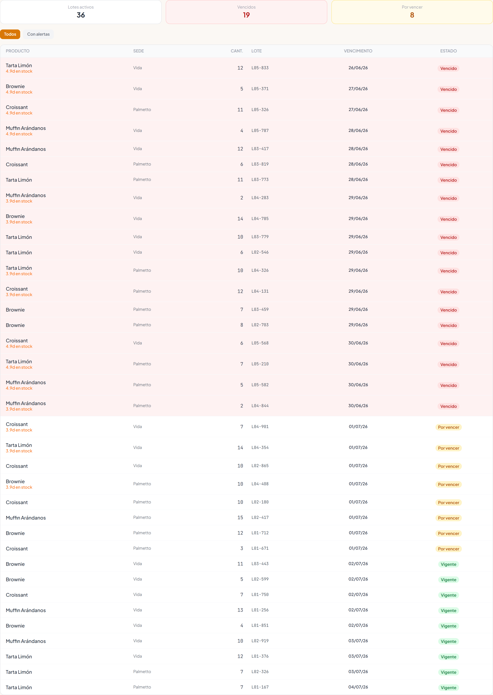

- Muestra KPIs (**Lotes activos**, **Vencidos**, **Por vencer**) y una tabla con producto, sede, cantidad, número de lote, vencimiento y estado.
- Filtre con **Todos** / **Con alertas**. No hay acciones de edición: el registro de lotes de pastelería lo hacen las baristas desde su propia pantalla.

### Limpieza, checklist semanal (`/limpieza`)

**Para qué sirve:** administrar el **checklist semanal de limpieza** de la sede: definir tareas, activarlas o desactivarlas, renombrarlas, agregar tareas personalizadas y dar el visto bueno.

**Cómo llegar:** escriba `/limpieza` en la dirección del navegador. (Trabaja sobre la sede asignada a su usuario.)

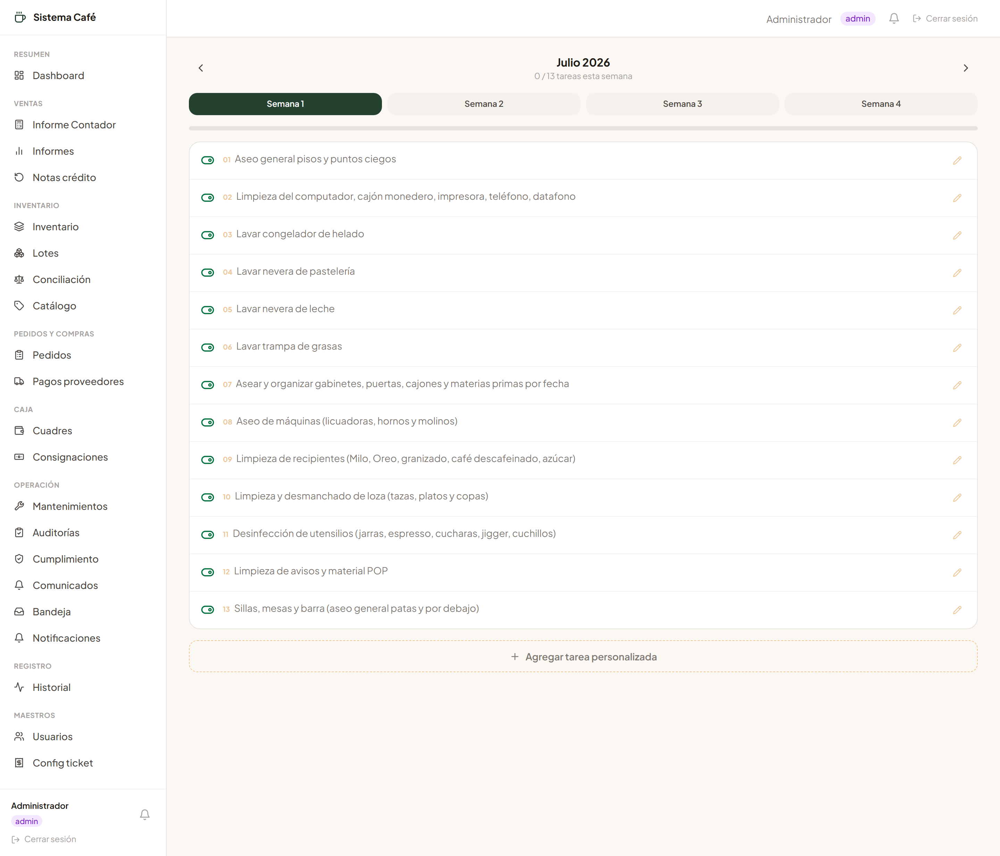

- **Navegar el mes** con las flechas ‹ › y elegir la **Semana** (Semana 1 a 4) con las pestañas.
- **Activar/desactivar una tarea** con su conmutador (una tarea inactiva no aparece en el checklist de las baristas).
- **Renombrar una tarea** con el **lápiz** de su fila.
- **Agregar tarea personalizada** con el botón al final de la lista.
- **Dar o quitar el VoBo** y **eliminar** registros de la semana desde los controles correspondientes.

### Ventas de emergencia (`/ventas`)

**Para qué sirve:** registrar ventas **manualmente** cuando no se puede usar el POS (por ejemplo, caída del sistema). Es una entrada de **emergencia**.

**Cómo llegar:** escriba `/ventas` en la dirección del navegador.

**Requisitos / datos necesarios:** debe haber un **turno abierto** con el **conteo de apertura** hecho. Si no hay turno, la pantalla ofrece abrir caja; si falta el conteo de apertura, pide completarlo primero.

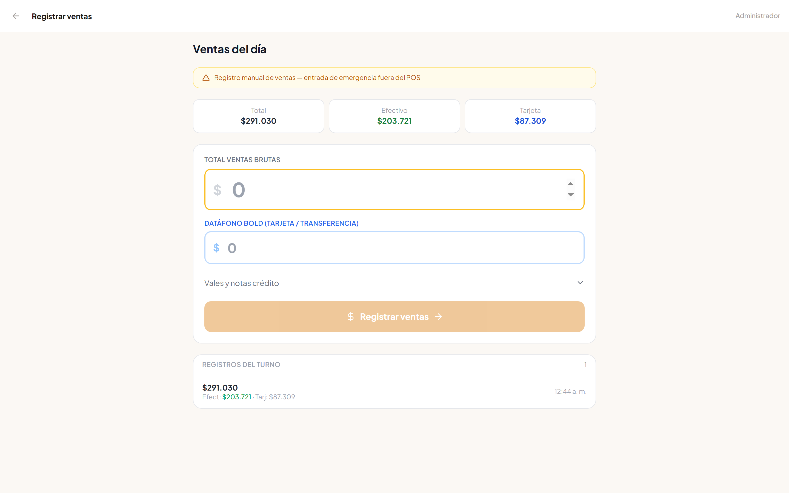

1. Verá un aviso de que es un **registro manual — entrada de emergencia fuera del POS**, y el resumen acumulado del turno (Total, Efectivo, Tarjeta).
2. Escriba el **Total ventas brutas**.
3. Escriba el **Datáfono Bold** (tarjeta / transferencia). El sistema calcula y muestra el **Efectivo calculado**.
4. Si corresponde, despliegue **Vales y notas crédito** para registrar esos montos y una nota.
5. Pulse **Registrar ventas**. Debajo queda el historial de registros del turno.

---

## Preguntas frecuentes

**1. ¿Cómo cambio el PIN del kiosko?**
En **Maestros → Usuarios**, en la tarjeta **PIN de kiosko**, pulse **Cambiar**, escriba el nuevo PIN (mínimo 4 caracteres) y **Guardar**.

**2. ¿Cómo agrego una barista?**
En **Maestros → Usuarios**, pulse **Nuevo usuario**, escriba el nombre, elija rol **Barista** y su sede, y pulse **Crear usuario**. La barista no necesita email ni contraseña: aparecerá para elegirla al abrir un turno.

**3. ¿Cómo creo otro administrador?**
Igual que una barista, pero elija rol **Admin** y complete además el **Email** y la **Contraseña** (mínimo 6 caracteres), que serán sus credenciales de inicio de sesión.

**4. ¿Cómo registro el pago de una factura de proveedor?**
En **Pedidos y compras → Pagos proveedores**, ubique la factura y pulse **Registrar pago**. Confirme el monto, elija la forma de pago (Efectivo, Bancos, Cheque u Otro), adjunte el soporte si lo tiene y pulse **Confirmar pago**. Recuerde que solo el pago en efectivo sale del cajón.

**5. ¿Cómo reviso los descuadres de caja?**
Desde el **Dashboard**, la tarjeta "descuadres de caja" lo lleva a **Informes**. Para el detalle por turno o por barista, use **Caja → Cuadres** (modo Historial). Cada turno con diferencia lo marca en rojo.

**6. ¿Cómo confirmo una consignación?**
En **Caja → Consignaciones**, pestaña **Consignaciones**, abra el día correspondiente y, en la consignación marcada como *pendiente*, pulse **Confirmar**.

**7. ¿Por qué la Conciliación aparece vacía?**
Porque la conciliación necesita un **conteo mensual cerrado** para ese mes y esa sede. Si el conteo no existe o está "en proceso", no hay diferencias que calcular. El conteo lo cierran las baristas desde el POS; verifique el mes, el año y la sede seleccionados.

**8. ¿Cómo cambio el logo del ticket?**
En **Maestros → Config ticket**, sección **Logo**, use **Subir logo** o **Cambiar**. Recuerde que la configuración del ticket es por sede y su cuenta debe tener una sede asignada.

**9. ¿Cómo elimino un producto duplicado?**
En **Inventario → Catálogo**, pulse **Duplicados**, ubique el registro repetido y pulse la papelera. Si el producto tiene historial de movimientos, no se podrá borrar; en ese caso, unifique el uso hacia el registro correcto.

**10. ¿Cómo fijo o cambio el precio de venta de un producto en el POS?**
En **Inventario → Catálogo**, en la columna **Precio POS** del producto, pulse el valor, escriba el nuevo precio y pulse Enter. Un producto sin precio no se vende en el POS.

**11. ¿Cómo publico un aviso para las baristas?**
En **Operación → Comunicados**, pulse **Nuevo**, escriba el mensaje (y opcionalmente un título), elija el destinatario (todas o una tienda), marque Urgente si aplica y pulse **Publicar**.

**12. ¿Cómo reviso o exporto las ventas de un mes para el contador?**
En **Ventas → Informe Contador**, elija el mes, el año y la sede, y pulse **Excel** (para el archivo) o **PDF** (para imprimir/guardar).

**13. ¿Cómo ajusto el stock real de un producto?**
En **Inventario → Inventario** (Control de inventario), modo Stock, expanda el producto, escriba la **cantidad real en bodega**, un motivo y pulse **Confirmar**. El sistema fija el stock a esa cantidad.

**14. Registré una venta manual pero no puedo entrar a `/ventas`. ¿Por qué?**
Esa pantalla requiere un **turno abierto** con **conteo de apertura** hecho. Si no hay turno o falta el conteo, la pantalla se lo indicará antes de dejar registrar.

**15. No veo el selector de sede en algunas pantallas. ¿Es normal?**
Sí. **Cumplimiento**, **Notificaciones** y **Config ticket** trabajan con la sede asignada a su usuario y no tienen selector. Si su cuenta no tiene sede, esas pantallas se lo indican; asigne una en **Usuarios**.

---

## Glosario

- **Sede (tienda):** cada local de su cafetería. Casi todas las pantallas trabajan por sede y muchas permiten ver "Todas" para el consolidado.
- **Turno:** el período de trabajo de caja, desde que se abre (con conteo de apertura y baristas asignadas) hasta que se cierra (con cuadre). La responsabilidad se asigna al abrir el turno.
- **Cuadre:** el arqueo del turno de caja, comparando lo esperado con lo contado. La **diferencia de caja** es el faltante o sobrante de efectivo, y la **diferencia Bold** es la del datáfono.
- **Consignación:** el efectivo que un turno debe llevar al banco. Se reconcilia comparando lo que **debe consignarse** con lo **consignado**.
- **Conciliación:** la comparación del stock **teórico** (sistema) contra el **conteo físico** mensual, valorizando faltantes y sobrantes en dinero.
- **Merma:** producto que se pierde o descarta (daño, vencimiento, consumo interno) y sale del inventario sin ser una venta.
- **Lote:** una entrada específica de un producto (con su proveedor, factura y fecha de vencimiento), que permite trazar su consumo y vencimiento.
- **Rotación:** medida de cuánto se mueve un producto en un período (entradas y salidas). Un producto "estancado" o "sin movimiento" rota poco.
- **Umbral crítico / mínimo / ideal:** los tres niveles de stock que definen el semáforo. Por debajo del **crítico** es urgente; el **mínimo** dispara "pedir"; el **ideal** es el objetivo de reposición.
- **Datáfono Bold:** el datáfono con el que se cobran las ventas con tarjeta o transferencia. En los cuadres, sus ventas se comparan contra lo registrado para detectar diferencias.
- **Nota crédito:** la reversión de una venta ya completada. Devuelve el dinero y, producto por producto, se decide si vuelve al inventario o no.
- **Sencilla:** el efectivo en billetes y monedas pequeñas para dar cambio. Las baristas la solicitan y el administrador la aprueba (pudiendo ajustar las denominaciones) desde la **Bandeja**.
- **PIN de kiosko:** el código que las baristas usan para activar la caja en cada dispositivo. Se administra en **Usuarios**.
- **VoBo (visto bueno):** validación del administrador sobre un cronograma de limpieza completado al 100%. Una vez dado, es irreversible.
