# Manual del/de la barista — cafe-sistema

Este es el manual de uso del sistema de la cafetería (**cafe-sistema**) para el rol de **barista**. El sistema administra toda la operación diaria de la tienda: la caja, las ventas en el punto de venta (POS), el inventario, la recepción de mercancía, las mermas, las consignaciones al banco y el cumplimiento de rutinas y limpieza. Este documento está pensado para el personal de mostrador —no se necesita conocimiento técnico— y explica, paso a paso, cómo operar la caja de principio a fin: activar el dispositivo, abrir el turno, contar el inventario, vender, usar las herramientas del día y cerrar correctamente.

---

## Cómo está organizado este manual

- Primero verá **el día a día de un/a barista**: un resumen corto de todo el flujo diario, en orden.
- Luego se explica el **modelo de kiosko** (por qué el dispositivo es compartido, qué es el PIN de sistema y por qué debe elegir quién está vendiendo).
- Después hay **una sección por cada pantalla**, en el mismo orden en que las usará durante el día. Cada sección tiene:
  - **Para qué sirve** — el objetivo de la pantalla.
  - **Cómo llegar** — los pasos exactos para abrirla.
  - **Requisitos** — lo que debe existir antes (cuando aplica).
  - **Una imagen** de la pantalla.
  - **Paso a paso** — cómo hacer cada acción.
  - **Consejos / notas** — advertencias y buenas prácticas.
- Al final encontrará las **Preguntas frecuentes** y un **Glosario** con los términos del sistema.

> Nota sobre el idioma de los botones: los nombres de botones y campos se citan **exactamente** como aparecen en la pantalla (por ejemplo, "Activar dispositivo", "Confirmar apertura"). Algunos textos de la aplicación usan un tono informal; en este manual las instrucciones están escritas en español neutro para que sean claras para todo el equipo.

---

## Tabla de contenido

- [Antes de empezar: instalar la app en el celular](#antes-de-empezar-instalar-la-app-en-el-celular)
1. [El día a día de un/a barista](#1-el-dia-a-dia-de-una-barista)
2. [El modelo de kiosko: dispositivo compartido y barista activa](#2-el-modelo-de-kiosko-dispositivo-compartido-y-barista-activa)
3. [Activar caja (activar el dispositivo)](#3-activar-caja-activar-el-dispositivo)
4. [Gestión de turno (abrir el turno)](#4-gestion-de-turno-abrir-el-turno)
5. [Conteo de apertura](#5-conteo-de-apertura)
6. [Cuadre de apertura](#6-cuadre-de-apertura)
7. [POS · Cobros (vender)](#7-pos--cobros-vender)
8. [Recibir mercancía (Ingresos)](#8-recibir-mercancia-ingresos)
9. [Mermas](#9-mermas)
10. [Inventario](#10-inventario)
11. [Solicitar pedido](#11-solicitar-pedido)
12. [Solicitar sencilla](#12-solicitar-sencilla)
13. [Consignaciones](#13-consignaciones)
14. [Movimiento de caja (Ingreso / Egreso)](#14-movimiento-de-caja-ingreso--egreso)
15. [Registrar novedad, temperatura y rutinas](#15-registrar-novedad-temperatura-y-rutinas)
16. [Historial de ventas](#16-historial-de-ventas)
17. [Mis ventas del turno](#17-mis-ventas-del-turno)
18. [Inventario mensual](#18-inventario-mensual)
19. [Conteo para compras](#19-conteo-para-compras)
20. [Pastelería](#20-pasteleria)
21. [Limpieza semanal](#21-limpieza-semanal)
22. [Entrada y salida de barista (relevos en el POS)](#22-entrada-y-salida-de-barista-relevos-en-el-pos)
23. [Entrega de turno](#23-entrega-de-turno)
24. [Conteo de cierre](#24-conteo-de-cierre)
25. [Cierre de turno](#25-cierre-de-turno)
26. [Salida de efectivo (cierre en kiosko)](#26-salida-de-efectivo-cierre-en-kiosko)
27. [Preguntas frecuentes](#27-preguntas-frecuentes)
28. [Glosario](#28-glosario)

---

## Antes de empezar: instalar la app en el celular

**Para qué sirve:** cafe-sistema es una aplicación web (una PWA). **No se descarga de Play Store ni de App Store**: se instala una sola vez desde el navegador del celular o la tablet. Una vez instalada aparece con su ícono (**"Café"**) en la pantalla de inicio, abre en pantalla completa como cualquier app y se actualiza sola.

**Qué necesita:**
- El celular o la tablet con conexión a internet.
- La dirección web del sistema: **https://cafe-sistema.pages.dev** (o la que le indique el administrador).

### Instalar en Android (con Chrome)
1. Abra **Chrome** e ingrese a la dirección del sistema.
2. Toque el menú **⋮** (los tres puntos, arriba a la derecha).
3. Toque **Instalar aplicación** (en algunos equipos aparece como **Agregar a la pantalla de inicio**).
4. Confirme tocando **Instalar**.
5. Listo: el ícono **Café** queda en la pantalla de inicio.

> Consejo: si al entrar aparece abajo un aviso o un botón **"Instalar"**, puede tocarlo directamente y saltear los pasos.

### Instalar en iPhone o iPad (con Safari)
> **Importante:** en iPhone y iPad la instalación **solo funciona desde Safari** (no desde Chrome ni otro navegador).
1. Abra **Safari** e ingrese a la dirección del sistema.
2. Toque el botón **Compartir** (el cuadrado con una flecha hacia arriba, en la barra de abajo).
3. Deslice la lista hacia abajo y toque **Agregar a inicio** (*Add to Home Screen*).
4. Toque **Agregar**, arriba a la derecha.
5. Listo: el ícono **Café** queda en la pantalla de inicio.

### Después de instalar
1. Abra la app **siempre desde el ícono "Café"** (no desde el navegador): así funciona en pantalla completa, como una app normal.
2. La primera vez le pedirá la **sede** y el **PIN de sistema** — vea [Activar caja](#3-activar-caja-activar-el-dispositivo).
3. La app **se actualiza automáticamente**: cuando el administrador publica cambios, se aplican solos la próxima vez que la abra con internet.

**Consejos / notas:**
- Deje el dispositivo con la app instalada y la caja activada; el modo kiosko mantiene la sesión abierta durante el turno.
- Para recibir avisos en el celular (stock, consignaciones), el administrador debe activar las notificaciones y usted debe **permitirlas** cuando el teléfono se lo pregunte.
- Si después de instalar no ve el ícono, verifique que usó el navegador correcto (**Chrome** en Android, **Safari** en iPhone) y que tenía internet.

---

## 1. El día a día de un/a barista

Este es el recorrido completo de un día normal. Los pasos 1 a 5 abren y desbloquean la caja; el paso 6 es la venta; los últimos pasos cierran el día.

1. **Activar caja.** Al encender el dispositivo (o después de un cierre), la pantalla pide la **sede** y el **PIN de sistema**. Esto vincula la tablet o computador a la tienda.
2. **Abrir turno.** En **Gestión de turno** elija el tipo de turno (Apertura / Intermedio / Cierre), marque quiénes son las baristas y cuente el efectivo con el que arranca la caja.
3. **Conteo de apertura.** Cuente físicamente el inventario y compárelo con el sistema. Esto es obligatorio para poder vender.
4. **Cuadre de apertura.** Cuente el efectivo de la caja, registre las ventas de tarjeta Bold y tome la foto del comprobante.
5. **Empezar a vender.** Con el conteo y el cuadre hechos, el turno queda **operativo** y se habilita el POS.
6. **Vender en el POS.** Arme la cuenta, cobre en efectivo, tarjeta o mixto e imprima el ticket.
7. **Herramientas durante el turno.** Desde el botón **Menú** o el dock inferior del POS: recibir mercancía, registrar mermas, ver inventario, pedir productos, pedir sencilla, registrar limpieza, novedades, temperatura y consignaciones.
8. **Entregas y relevos.** Si entra o sale una barista a mitad de turno, se registra con su respectivo cuadre de caja.
9. **Conteo de cierre.** Al terminar el día, cuente de nuevo el inventario físico.
10. **Cuadre y cierre.** Cuente el efectivo por denominaciones, registre el datáfono Bold, adjunte la foto obligatoria, justifique diferencias si las hay y **cierre el turno**.
11. **Consignar.** El efectivo del cierre queda pendiente de consignar; registre la consignación al banco con su comprobante.

---

## 2. El modelo de kiosko: dispositivo compartido y barista activa

En la cafetería, **las baristas no tienen usuario ni contraseña individuales**. El sistema funciona en modo **kiosko**: un mismo dispositivo (tablet o computador de la caja) queda vinculado a una sede y lo usan todas las baristas del turno.

Cómo funciona, en términos simples:

- **El PIN de sistema activa el dispositivo, no a la persona.** Se ingresa una sola vez al inicio (pantalla **Activar caja**) y el dispositivo queda listo para trabajar. No hay que volver a escribirlo en cada acción.
- **Cada acción se atribuye a la "barista activa".** Como el dispositivo es compartido, el sistema necesita saber **quién** está operando en cada momento. Por eso, en la parte superior del POS aparece un selector que dice **"[nombre] ▾"** (por ejemplo, "Operando: María ▾"). La barista que esté seleccionada ahí quedará registrada como responsable de cada venta, merma, limpieza, etc.
- **Quién puede aparecer en el selector.** Solo las baristas que se marcaron al abrir el turno. Si hay una sola barista, el selector no despliega opciones (no hay a quién cambiar). Si hay varias, puede cambiar de una a otra con un toque.
- **Cambiar de barista es importante.** Cuando otra persona toma la caja, debe cambiarse la barista activa en el selector, para que las ventas y registros queden a nombre de quien realmente los hace.
- **Cerrar el turno desactiva el dispositivo.** Al finalizar el cierre (o al usar "Desactivar dispositivo"), la sesión se cierra y la aplicación vuelve a la pantalla **Activar caja**. Es la forma de confirmar que todo quedó cerrado y guardado.

En resumen: **el PIN abre la caja del local; el selector de barista dice quién está vendiendo.**

---

## 3. Activar caja (activar el dispositivo)

**Para qué sirve.** Vincular el dispositivo a una sede e iniciar el modo kiosko con el PIN de sistema. Es la primera pantalla que aparece en cualquier dispositivo que no tenga sesión activa.

**Cómo llegar.** Abra la aplicación en un dispositivo sin sesión. También aparece automáticamente después de un cierre de turno o de "Desactivar dispositivo".

**Requisitos.** Ninguno previo, salvo tener a mano el **PIN de sistema** de la cafetería.

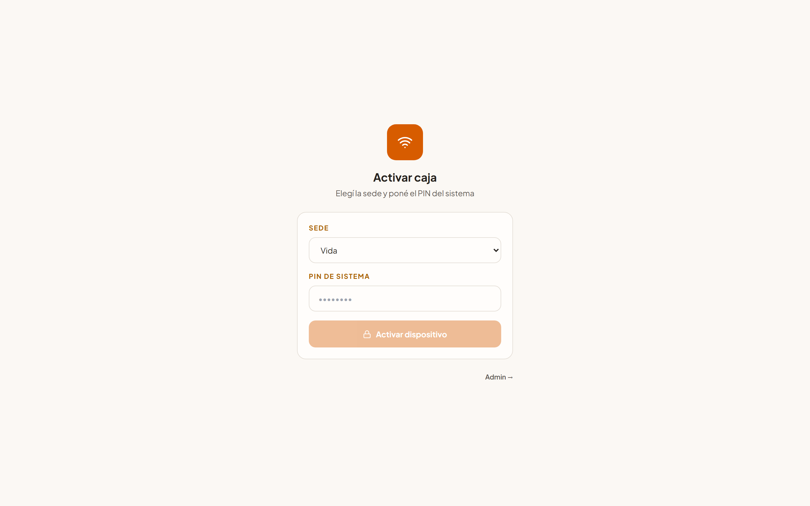

**Paso a paso**

Cómo activar el dispositivo:

1. En **SEDE**, abra el desplegable y elija la sede correcta. El sistema recuerda la última sede usada y la deja preseleccionada.
2. En **PIN DE SISTEMA**, escriba el PIN. El campo muestra puntos en lugar de números por seguridad.
3. Presione el botón **Activar dispositivo** (o la tecla Enter). Cuando el botón dice "Activando...", espere unos segundos.
4. Si el dispositivo se activa correctamente, la aplicación continúa sola: lo lleva al POS si el turno ya está operativo, o a **Gestión de turno** si falta abrir el turno.

Cómo actuar si el PIN es incorrecto:

1. Aparecerá un mensaje de error debajo del campo (por ejemplo, "PIN de kiosco incorrecto").
2. Verifique la sede seleccionada y vuelva a escribir el PIN. Si el problema persiste, consulte con el administrador.

**Consejos / notas**

- El enlace **Admin →** (abajo a la derecha) es solo para el administrador; el personal de barra no lo usa.
- El PIN es de la tienda, no personal. No lo comparta con clientes ni lo deje anotado a la vista de la caja.

---

## 4. Gestión de turno (abrir el turno)

**Para qué sirve.** Es el centro del turno. Desde aquí se **abre el turno**, se ve el estado del turno abierto (ventas, efectivo, baristas, tiempo) y se salta a los pasos que falten (conteo de apertura, conteo de cierre) o al POS.

**Cómo llegar.** Después de activar el dispositivo, si no hay un turno operativo la aplicación lo lleva aquí automáticamente. También desde el botón **Menú** → **Turno**, o desde el botón **Abrir turno**.

**Requisitos.** Dispositivo activado (sesión de kiosko activa).

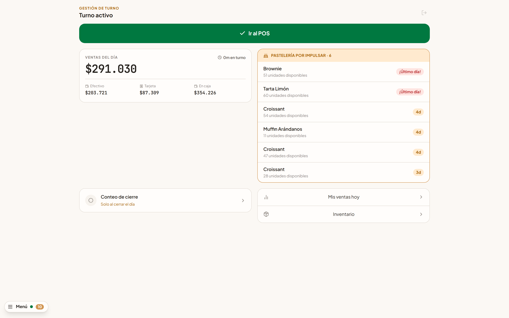

**Paso a paso**

Cómo abrir un turno (cuando no hay turno activo):

1. Toque **Abrir turno**.
2. Elija el **tipo de turno**:
   - **Apertura** — primer turno del día.
   - **Intermedio** — relevo de turno.
   - **Cierre** — último turno del día.
3. Marque las **baristas de este turno** tocando cada nombre de la lista (puede seleccionar varias). Los seleccionados quedan resaltados con un chulo.
4. **Cuente el efectivo de inicio** con el contador de billetes y monedas. El sistema muestra cuánto **debería tener** (lo que dejó el cierre anterior pendiente de consignar).
5. Si el efectivo contado es distinto del esperado, aparece la **diferencia** y debe escribir el **motivo** en el recuadro de justificación.
6. Toque **Confirmar apertura**. El sistema lo lleva directamente al paso que falte: al **conteo de apertura** si el turno aún no es operativo, o al **POS** si ya lo es.

Cómo entrar al POS (cuando ya hay turno operativo):

1. Toque el botón verde **Ir al POS**.

Cómo continuar los pasos pendientes:

1. Si el POS aparece bloqueado, la tarjeta **"POS bloqueado — completá para vender"** muestra un botón **Conteo de apertura**. Tóquelo para completarlo.
2. Para el fin del día, use el botón **Conteo de cierre** (marcado "Solo al cerrar el día").

Cómo revisar el estado del turno:

1. En la tarjeta **Ventas del día** verá el total vendido, más el desglose **Efectivo**, **Tarjeta** y **En caja**, y el tiempo que lleva el turno.
2. En **Baristas en turno** verá quiénes están operando.
3. En **Pastelería por impulsar** verá qué productos conviene ofrecer según los días que llevan en inventario (los marcados **¡Último día!** son urgentes).
4. Los accesos **Mis ventas hoy** e **Inventario** llevan a esas pantallas.

Cómo desactivar el dispositivo:

1. Toque el ícono de salida (esquina superior derecha). Esto cierra la sesión del kiosko y vuelve a la pantalla **Activar caja**. Úselo solo si necesita liberar el dispositivo.

**Consejos / notas**

- Contar bien el efectivo de inicio evita descuadres al cerrar. Si difiere de lo esperado, **siempre** anote el motivo.
- Un turno recién abierto **no** habilita el POS por sí solo: hace falta el conteo de apertura y el cuadre de apertura.

---

## 5. Conteo de apertura

**Para qué sirve.** Registrar el conteo físico del inventario al abrir, comparándolo con el stock que tiene el sistema. Es el **Paso 2 de 5** del flujo de apertura y es obligatorio para desbloquear el POS.

**Cómo llegar.** Automáticamente después de **Confirmar apertura**, o con el botón **Conteo de apertura** de la tarjeta "POS bloqueado" en Gestión de turno.

**Requisitos.** Turno abierto sin conteo de apertura del día.

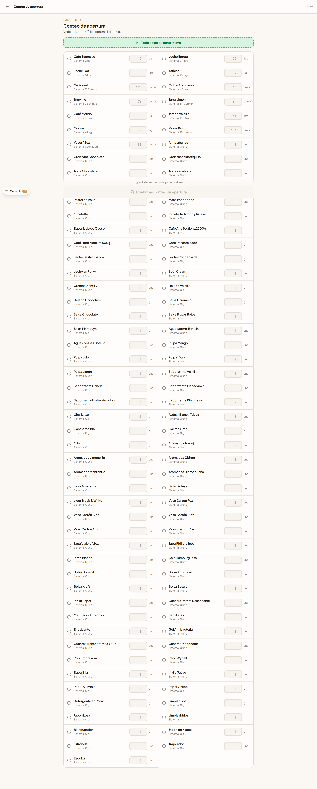

**Paso a paso**

Cómo contar un producto:

1. Recorra la lista. Cada producto muestra el stock del sistema (por ejemplo, "Sistema: 12 und").
2. Escriba en la casilla la **cantidad real** que contó físicamente.
   - Si el número **coincide**, la fila se marca en verde.
   - Si **difiere**, la fila se marca en rojo y muestra la diferencia (por ejemplo, "Diferencia: −2 und").
3. Para productos **fraccionables** (a granel: bolsas o botellas), en lugar de una casilla verá el control de **nivel de envase**: indique cuántos envases sellados hay y qué tan lleno está el envase abierto.
4. Arriba verá el conteo de **correctos** y de **diferencias**, y una barra de progreso.

Cómo usar el atajo "Todo coincide con sistema":

1. Toque **Todo coincide con sistema**.
2. Confirme en el aviso que efectivamente contó físicamente y todo coincide.
3. Esto fija todas las cantidades al stock del sistema.

Cómo confirmar el conteo:

1. Cuando termine, toque **Confirmar conteo de apertura** (abajo).
2. El sistema guarda el conteo y lo lleva al **Cuadre de apertura**.

**Consejos / notas**

- El atajo "Todo coincide con sistema" es cómodo, pero úselo con responsabilidad: si lo aplica sin contar de verdad, **oculta diferencias reales** que después aparecerán como faltantes.
- Debe ingresar al menos un valor para poder confirmar.

---

## 6. Cuadre de apertura

**Para qué sirve.** Registrar el cuadre de caja al abrir: el efectivo contado, las ventas de tarjeta Bold y la foto del comprobante. Es el **Paso 3 de 5**.

**Cómo llegar.** Aparece automáticamente después de confirmar el conteo de apertura.

**Requisitos.** Turno activo.

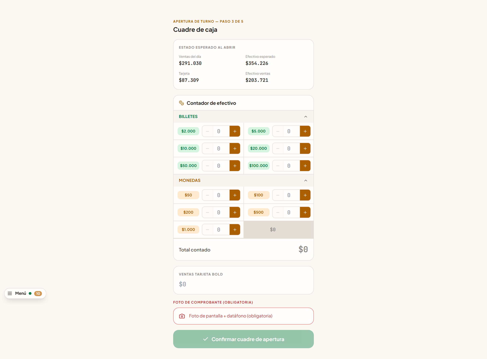

**Paso a paso**

Cómo registrar el cuadre de apertura:

1. Revise el bloque **Estado esperado al abrir** (ventas del día, efectivo esperado, tarjeta, efectivo de ventas).
2. **Cuente el efectivo** con el contador de billetes y monedas.
3. En **Ventas tarjeta Bold**, escriba el total que muestra el datáfono Bold.
4. Toque el botón de **Foto de comprobante (obligatoria)**, tome la foto de la pantalla y el datáfono con la cámara. Cuando la foto queda adjunta, el botón se pone verde.
5. Toque **Confirmar cuadre de apertura**. El sistema lo devuelve a **Gestión de turno**, donde ya podrá entrar al POS.

**Consejos / notas**

- La **foto es obligatoria**: sin ella el botón de confirmar permanece deshabilitado.
- Este paso deja el turno **operativo** (junto con el conteo de apertura), y recién ahí se habilita la venta.

---

## 7. POS · Cobros (vender)

**Para qué sirve.** Es la pantalla principal de venta: armar la cuenta, cobrar (efectivo, tarjeta o mixto), imprimir y reimprimir el ticket, y acceder a las herramientas del turno.

**Cómo llegar.** Desde **Gestión de turno → Ir al POS**, o desde el botón **Menú → POS**.

**Requisitos.** El turno debe estar **operativo** (conteo de apertura + cuadre de apertura hechos). Si falta algo, el sistema lo devuelve a Gestión de turno o al conteo de apertura.

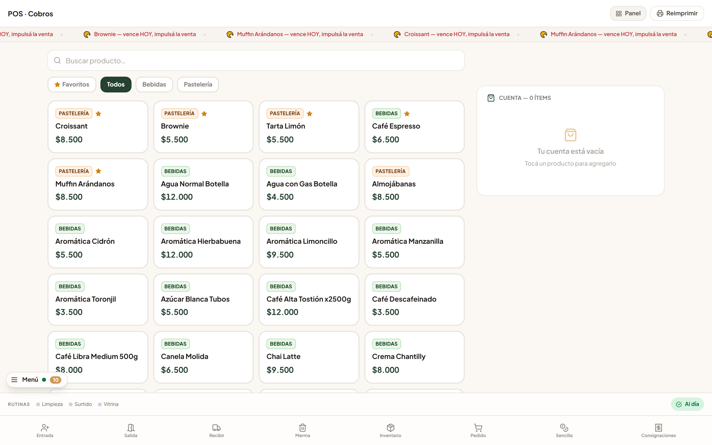

**Paso a paso**

Cómo armar la cuenta:

1. Use la barra **Buscar producto...** o los filtros de categoría (**Favoritos**, **Todos**, **Bebidas**, **Pastelería**) para encontrar el producto.
2. Toque un producto para agregarlo a la cuenta. Cada toque suma una unidad.
3. En el panel de la cuenta (a la derecha en pantalla grande, o la hoja **Tu cuenta** en celular):
   - Use **+** / **−** para ajustar la cantidad de una línea.
   - Quite una línea con su botón de eliminar.
   - Aplique un **descuento** por línea si corresponde.
   - Use **Limpiar** para vaciar toda la cuenta.

Cómo cobrar e imprimir el ticket:

1. Toque **Cobrar**. Se abre la ventana **Cobrar**, que muestra el **Total a cobrar**.
2. Elija el **método de pago**:
   - **Efectivo:** escriba con cuánto paga el cliente (con el teclado numérico en celular). El sistema calcula el **cambio** en vivo; si falta dinero, muestra "Falta".
   - **Tarjeta:** confirme el pago en el datáfono antes de continuar.
   - **Mixto:** escriba cuánto va en **Efectivo** y cuánto en **Tarjeta**. Los dos montos deben sumar el total (el sistema avisa si "Falta" o hay "Suma de más").
3. Toque **Confirmar y cobrar $…**. Aparece **Venta registrada** (con el cambio si aplica) y el ticket se **imprime** automáticamente.

Cómo reimprimir el último ticket:

1. En la cabecera del POS, toque **Reimprimir**. Se vuelve a imprimir el último ticket del turno.
2. Si necesita reimprimir un ticket más antiguo, use la pantalla **Historial de ventas** (sección 16).

Cómo cambiar la barista que está vendiendo:

1. En la cabecera del POS, toque el selector con el nombre (**"[nombre] ▾"**).
2. Elija la barista que va a operar. A partir de ese momento, las ventas y registros quedan a su nombre.
3. Si solo hay una barista en el turno, el selector no despliega opciones.

Cómo abrir el Panel del turno:

1. Toque el botón **Panel** (cabecera). Muestra el estado operativo del turno: procesos obligatorios de apertura/cierre, rutinas de un toque (Limpieza, Surtido, Vitrina), stock crítico y la bitácora del turno.
2. Si el botón **Panel** tiene un número rojo, hay rutinas en alerta que conviene atender.

Cómo usar la barra de herramientas inferior (dock):

1. En la parte de abajo del POS está el dock con: **Entrada**, **Salida**, **Recibir**, **Merma**, **Inventario**, **Pedido**, **Sencilla**, **Consignaciones**.
2. Toque una para abrirla como panel lateral, sin salir del POS. Toque de nuevo (o la **X**) para cerrarla.

Cómo leer el ticker de alertas:

1. En la franja superior del POS corren avisos operativos (por ejemplo, pastelería por vencer o "impulsa la venta"). Son recordatorios; no interrumpen la venta.

**Consejos / notas**

- Antes de empezar a cobrar, verifique que en el selector aparece **la barista correcta**.
- El botón **Menú** flotante (abajo a la izquierda) abre las mismas herramientas y más, incluso fuera del POS.
- Si un cobro falla, la cuenta **no se pierde**: puede reintentar o cambiar el método de pago.

---

## 8. Recibir mercancía (Ingresos)

**Para qué sirve.** Registrar la recepción de mercancía de un proveedor: proveedor, total de la factura, productos recibidos, tipo de pago y foto de la factura. Al registrarlo, **suma stock** al inventario.

**Cómo llegar.** Botón **Menú → Herramientas → Recibir**, o en el POS: dock inferior → **Recibir**.

**Requisitos.** Sesión activa.

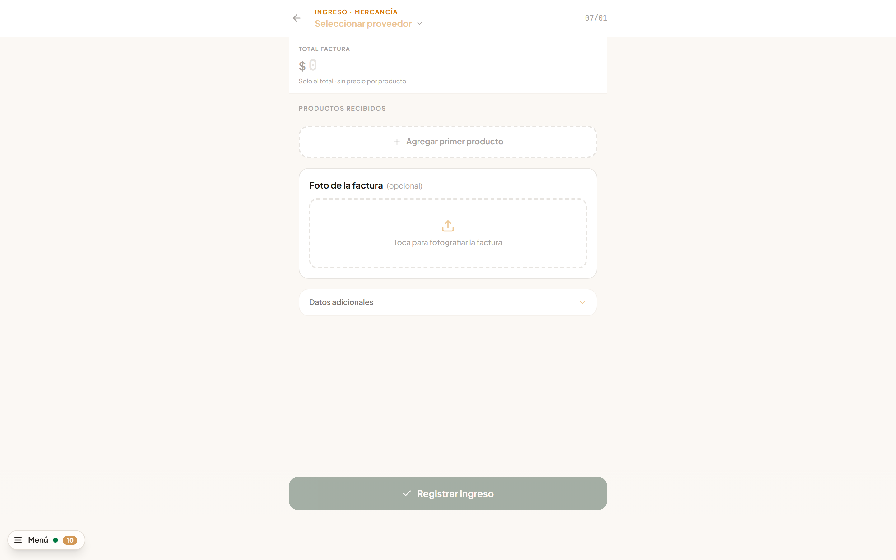

**Paso a paso**

Cómo elegir el proveedor:

1. Toque **Seleccionar proveedor** (arriba).
2. Escriba o busque en el historial. Toque el proveedor deseado.
3. Si no existe, escriba el nombre y toque **Crear proveedor "…"**.

Cómo cargar los productos recibidos:

1. Escriba el **Total factura** (solo el total; no se pide precio por producto).
2. Toque **Agregar primer producto** (o **Otro**).
3. Busque el producto y selecciónelo.
4. Escriba la **cantidad** recibida. Opcionalmente el **Lote** y la fecha de **Vence**.
5. Toque **Agregar a la factura**. Repita por cada producto.
6. Para quitar un producto de la lista, use su botón de eliminar.

Cómo completar datos adicionales y la foto:

1. En **Foto de la factura (opcional)** puede fotografiar la factura.
2. Despliegue **Datos adicionales** para registrar **N° Factura**, **Tipo de pago** (Contado / Crédito / Bancos) y **Fecha recibido**.

Cómo registrar el ingreso:

1. Toque **Registrar** (muestra el total). El sistema guarda la factura y suma el stock.

**Consejos / notas**

- El **lote y el vencimiento los define el proveedor**: si la mercancía no los trae, déjelos vacíos. No invente fechas.
- El tipo de pago importa para la caja: **Contado (efectivo)** afecta el efectivo del día; **Crédito** y **Bancos** quedan como registro.

---

## 9. Mermas

**Para qué sirve.** Registrar bajas de inventario (**consumo** o **daño**) o **traslados** a otra sede, y confirmar traslados que llegan desde otra sede.

**Cómo llegar.** Botón **Menú → Herramientas → Merma**, o en el POS: dock inferior → **Merma**.

**Requisitos.** Sesión activa.

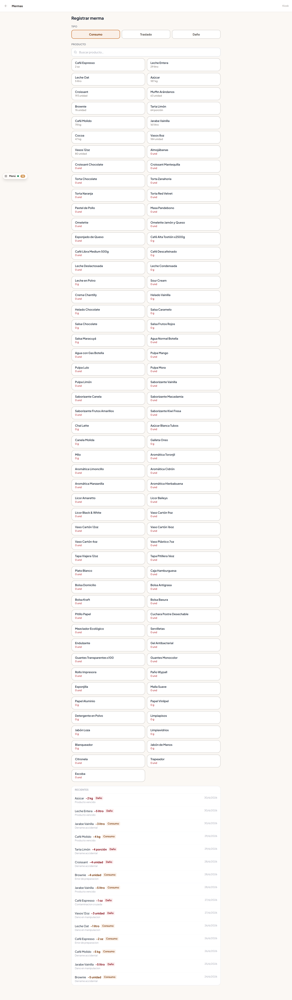

**Paso a paso**

Cómo confirmar un traslado que llega (entrante):

1. Si hay **Traslados por recibir**, revise cada línea (producto, sede de origen, cantidad).
2. Toque **Recibido** para confirmar que llegó. Esto suma el stock a su sede.

Cómo registrar una merma o un traslado:

1. Elija el **Tipo**: **Consumo**, **Traslado** o **Daño**.
2. Si es **Traslado**, elija la **sede destino**.
3. Busque y seleccione el **producto** (solo puede mermar lo que hay en stock).
4. Escriba la **cantidad** (no puede superar el stock disponible).
5. Si es Consumo o Daño, escriba el **motivo** (por ejemplo, "vencido", "caída"). En Traslado el motivo se completa solo.
6. Toque **Confirmar consumo / traslado / daño**.

Cómo revisar las mermas recientes:

1. Al final de la pantalla verá el historial con el tipo, la cantidad y, para traslados, el estado (**Pendiente** / **Recibido**).

**Consejos / notas**

- La cantidad se limita al stock: si intenta mermar más de lo que hay, el sistema lo impide.
- Un traslado no descuenta del inventario de destino hasta que esa sede lo marque como **Recibido**.

---

## 10. Inventario

**Para qué sirve.** Ver el stock de la sede con alertas (agotado / bajo / ok) y ajustar existencias por producto (entrada, salida o ajuste).

**Cómo llegar.** Botón **Menú → Herramientas → Inventario**; en el POS: dock → **Inventario**; o desde **Gestión de turno → Inventario**.

**Requisitos.** Sesión activa.

**Paso a paso**

Cómo consultar el stock:

1. Use **Buscar producto…** para filtrar.
2. Cada producto muestra el stock actual, el mínimo y un punto de color: **rojo** (sin stock), **ámbar** (stock bajo), **verde** (ok).
3. Arriba se indican cuántos productos están **sin stock** y cuántos con **stock bajo**.
4. El botón de recargar (ícono circular) actualiza los datos.

Cómo ajustar el stock de un producto:

1. Toque **+** (entrada) o **−** (salida) en la fila del producto. Se abre una ventana.
2. Elija el tipo:
   - **entrada** — suma la cantidad indicada.
   - **salida** — resta la cantidad indicada.
   - **ajuste** — **fija** el stock al valor que escriba (no suma ni resta; reemplaza el actual).
3. Escriba la **cantidad** y, opcionalmente, el **motivo**.
4. Toque **Confirmar**.

**Consejos / notas**

- El **ajuste FIJA el stock**: si escribe 10, el sistema queda en 10 exactamente. Úselo solo cuando cuenta físicamente y quiere corregir el número.
- Si aparece "Stock insuficiente", verifique el stock actual antes de volver a intentar.

---

## 11. Solicitar pedido

**Para qué sirve.** Armar y enviar al administrador una solicitud de reposición de productos, con sugerencias automáticas para los que tienen stock bajo.

**Cómo llegar.** Botón **Menú → Herramientas → Pedido**; en el POS: dock → **Pedido**.

**Requisitos.** Sesión activa.

**Paso a paso**

Cómo agregar productos con stock bajo:

1. Arriba se muestran los **productos con stock bajo** y una **cantidad sugerida**.
2. Toque **+ pedir** en un producto, o **Agregar todos** para incorporarlos todos de una vez.

Cómo agregar cualquier producto:

1. En la lista inferior, busque el producto y tóquelo para agregarlo.

Cómo ajustar y enviar:

1. En **Productos solicitados**, use **+** / **−** para cambiar cantidades o el botón para **quitar** un ítem.
2. Escriba una **nota al administrador** (opcional).
3. Toque **Enviar solicitud**. El administrador recibe el pedido.

**Consejos / notas**

- Las cantidades sugeridas son una guía; ajústelas según lo que realmente necesite la tienda.

---

## 12. Solicitar sencilla

**Para qué sirve.** Pedir cambio (sencilla) al administrador, indicando cuánto necesita por cada denominación de billetes y monedas.

**Cómo llegar.** Botón **Menú → Herramientas → Sencilla**; en el POS: dock → **Sencilla**.

**Requisitos.** Sesión activa.

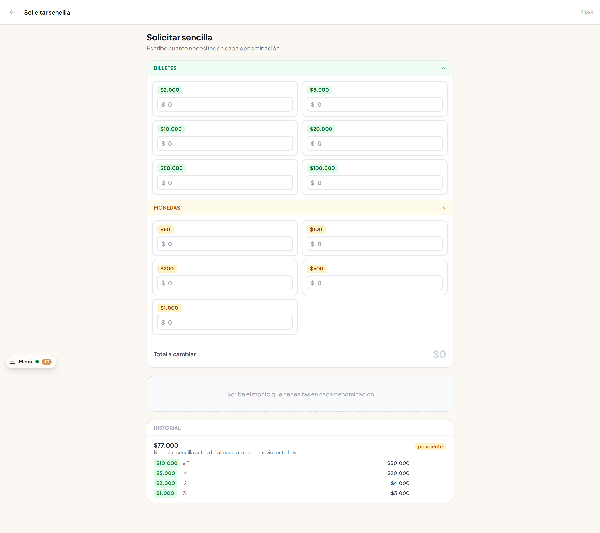

**Paso a paso**

Cómo armar la solicitud:

1. En **Billetes** y **Monedas**, escriba el **monto en pesos** que necesita de cada denominación (por ejemplo, $100.000 en billetes de $10.000).
2. El sistema muestra **×cantidad** cuando el monto es múltiplo válido de la denominación, o **no válido** si no lo es.
3. Revise el **Total a cambiar** (con el desglose en billetes y monedas).
4. Use **Limpiar** para empezar de cero.

Cómo enviar:

1. Escriba el **Motivo / nota para el admin** (obligatorio).
2. Toque **Enviar solicitud**.
3. En el **Historial** verá cada solicitud con su estado: **pendiente**, **aprobada** o **rechazada**.

**Consejos / notas**

- Si un monto queda marcado como "no válido", corríjalo para que sea múltiplo de esa denominación; de lo contrario no suma al total.

---

## 13. Consignaciones

**Para qué sirve.** Registrar la **consignación al banco** del efectivo que quedó pendiente de los cierres, adjuntando el comprobante bancario. Muestra cuánto hay por consignar y el desglose por turno.

**Cómo llegar.** Botón **Menú → Herramientas → Consignaciones**; en el POS: dock → **Consignaciones**.

**Requisitos.** Sesión activa.

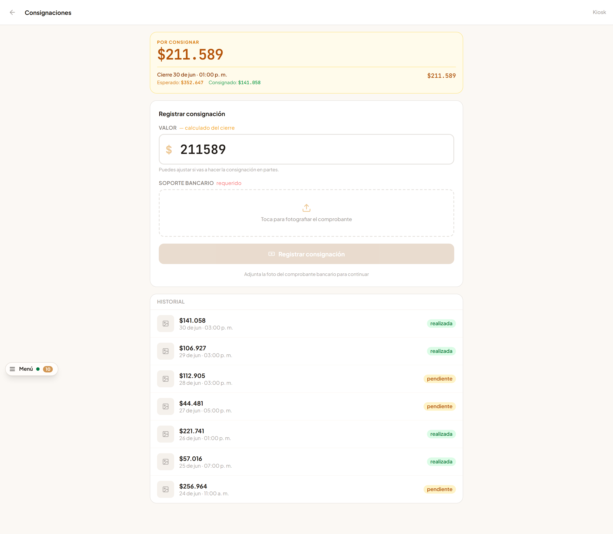

**Paso a paso**

Cómo ver lo que hay por consignar:

1. En la parte superior verá **Por consignar** (en ámbar) o **Al día** (en verde).
2. Si hay varios turnos pendientes, toque **… turnos** para ver el desglose por cierre (esperado, consignado y pendiente de cada uno).

Cómo registrar la consignación:

1. En **Valor**, revise o ajuste el monto. Viene pre-llenado con el total pendiente; puede reducirlo si va a consignar por partes.
2. Toque el recuadro de **Soporte bancario** y fotografíe el comprobante del banco. **Es obligatorio.**
3. Toque **Registrar consignación**.
4. En el **Historial** aparece la consignación con su miniatura, valor, fecha y estado.

**Consejos / notas**

- El **comprobante bancario es obligatorio**: sin la foto el botón permanece deshabilitado.
- Puede consignar en partes: registre cada consignación con su propio comprobante y el pendiente se irá reduciendo.
- No dejar consignaciones pendiente al día siguiente: el efectivo esperado de la apertura arrastra ese pendiente.

---

## 14. Movimiento de caja (Ingreso / Egreso)

**Para qué sirve.** Registrar un **ingreso** o un **egreso** de efectivo de la caja durante el turno (vales, pagos a proveedor, aportes), con foto de soporte opcional.

**Cómo llegar.** Botón **Menú → Caja** (requiere turno abierto). Se abre como ventana; no tiene pantalla propia.

**Requisitos.** Turno activo.

*(Esta acción es una ventana emergente y no tiene captura propia en este manual.)*

**Paso a paso**

Cómo registrar un movimiento:

1. Elija el tipo: **Ingreso** (entra dinero) o **Egreso** (sale dinero).
2. Escriba el **Concepto** (por ejemplo, "vale caja" o "pago proveedor pan").
3. Escriba el **Valor**.
4. Opcionalmente, adjunte una **foto soporte**.
5. Toque **Registrar**.

**Consejos / notas**

- Los ingresos y egresos afectan el **efectivo esperado** en caja y el **monto a consignar** del cierre. Regístrelos siempre en el momento, con el concepto claro.

---

## 15. Registrar novedad, temperatura y rutinas

Estas tres acciones son **ventanas rápidas** que se registran sin salir de la pantalla actual.

**Cómo llegar.**
- **Novedad** y **Temp.**: botón **Menú → sección "Registrar"**.
- **Rutinas**: desde el **Panel del turno** (en el POS). Las rutinas pendientes aparecen con un número en el botón **Menú**.

**Requisitos.** Sesión activa. Para temperatura deben existir equipos configurados; para rutinas, plantillas configuradas.

### Registrar novedad

**Para qué sirve.** Dejar registrada una novedad o incidente del turno (equipo, personal, cliente, seguridad), con su nivel, y marcar si requiere seguimiento en el siguiente turno.

Cómo registrar una novedad:

1. Escriba el **título** ("¿Qué pasó?") y el **detalle** (opcional).
2. Elija la **categoría** (incidente, equipo, personal, cliente, seguridad, otro) y el **nivel** (info, importante, urgente).
3. Marque **Requiere seguimiento** si debe pasar al siguiente turno.
4. Toque **Registrar novedad**.

Cómo resolver una novedad pendiente:

1. En el menú, junto a **Novedades sin resolver**, toque **resolver** en la novedad que ya quedó atendida.

### Registrar temperatura

**Para qué sirve.** Registrar la lectura de temperatura de un equipo (nevera, vitrina) y avisar si está fuera de rango.

Cómo registrar una lectura:

1. Elija el **equipo** (muestra su rango permitido).
2. Escriba la **temperatura en °C**. Si está fuera de rango, el sistema lo advierte.
3. Toque **Registrar lectura**.

### Registrar rutinas

**Para qué sirve.** Marcar de un toque las rutinas pendientes del turno (por ejemplo, limpieza, surtido, vitrina o una lectura).

Cómo registrar una rutina:

1. En el Panel del turno, revise las rutinas con su progreso (hechas / esperadas).
2. Toque el botón de registrar en la rutina correspondiente. Si la rutina pide un valor (por ejemplo, una temperatura), escríbalo cuando se le solicite.

**Consejos / notas**

- Las novedades marcadas para seguimiento son la forma de comunicar algo importante al turno siguiente. Úselas para no perder información entre relevos.

---

## 16. Historial de ventas

**Para qué sirve.** Consultar y **buscar** ventas del día o de un rango de fechas, filtrar por método de pago, ver el detalle de cada ticket y **reimprimirlo**.

**Cómo llegar.** Botón **Menú → Herramientas → Ventas**.

**Requisitos.** Sesión activa.

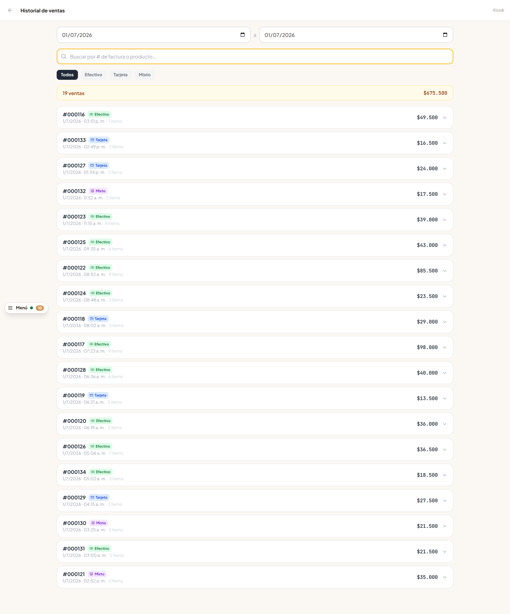

**Paso a paso**

Cómo buscar una venta:

1. Elija el **rango de fechas** (desde / hasta). Por defecto muestra el día de hoy.
2. Use la barra **Buscar por # de factura o producto…** para encontrar una venta específica.
3. Filtre por método con los botones **todos / efectivo / tarjeta / mixto**.
4. Arriba verá el resumen del filtro: número de ventas y total.

Cómo ver el detalle y reimprimir:

1. Toque un ticket para expandirlo. Verá los ítems, el descuento y el desglose (efectivo/tarjeta/cambio según el método).
2. Toque **Reimprimir ticket** para volver a imprimirlo.

**Consejos / notas**

- Los tickets anulados aparecen marcados como **Anulada** y no suman al total del filtro.
- Esta pantalla sirve para **buscar y reimprimir**. Para el resumen rápido del turno actual, use **Mis ventas del turno** (sección 17).

---

## 17. Mis ventas del turno

**Para qué sirve.** Ver de un vistazo los indicadores del turno actual (total, número de ventas, efectivo, tarjeta) y la lista de tickets del turno.

**Cómo llegar.** **Gestión de turno → Mis ventas hoy**.

**Requisitos.** Turno activo. Sin turno, la pantalla invita a abrir uno.

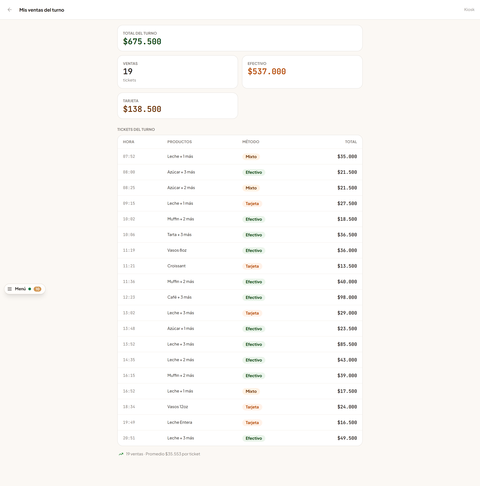

**Paso a paso**

Cómo revisar el turno:

1. Vea los indicadores: **Total del turno**, **Ventas** (número de tickets), **Efectivo** y **Tarjeta**.
2. Abajo, en **Tickets del turno**, revise cada venta (hora, productos, método y total).
3. Al final se muestra el **promedio por ticket**.

**Consejos / notas**

- Es un resumen de solo lectura; no permite reimprimir. Para eso use **Historial de ventas**.

---

## 18. Inventario mensual

**Para qué sirve.** Hacer el conteo físico **mensual** valorizado, agrupado por categoría, y cerrar el mes (registra la diferencia valorizada).

**Cómo llegar.** Botón **Menú → Herramientas → Inv. mensual**.

**Requisitos.** Sesión activa. Al entrar, el sistema inicia o recupera el conteo del mes en curso.

**Paso a paso**

Cómo contar:

1. Recorra los grupos por categoría (Insumos, Pastelería, Bebidas).
2. Escriba la **cantidad real** de cada producto. Para fraccionables, use el control de **nivel de envase**.
3. Cada fila muestra la **diferencia** frente al sistema, y arriba el avance (contados / total).

Cómo guardar y cerrar:

1. Toque **Guardar avance** para conservar el progreso y continuar más tarde.
2. Cuando termine, toque **Cerrar conteo**. Confirme el aviso: **el cierre es irreversible** y ya no se puede editar.
3. Una vez cerrado, la pantalla muestra la **diferencia neta valorizada** en modo de solo lectura.

**Consejos / notas**

- **Cerrar conteo** no se puede deshacer. Verifique bien antes de cerrar; mientras tanto use **Guardar avance**.

---

## 19. Conteo para compras

**Para qué sirve.** Enviar al administrador un conteo físico **parcial** para que ajuste el stock **antes de comprar**. Solo se envían los productos que usted contó, con una nota opcional.

**Cómo llegar.** Botón **Menú → Herramientas → Conteo compras**.

**Requisitos.** Sesión activa.

**Paso a paso**

Cómo enviar un conteo para compras:

1. Recorra los productos por categoría. Cada fila muestra la cantidad del sistema como referencia.
2. Escriba la **cantidad real** solo de los productos que va a revisar (no hace falta contar todo).
3. Junto a cada valor verá la **diferencia** frente al sistema.
4. Opcionalmente, escriba una **Nota** (por ejemplo, "faltan insumos de pastelería, pedido urgente").
5. Toque **Enviar Conteo al Admin**. El administrador revisará las diferencias y ajustará el stock.
6. El botón **Recargar** trae los datos actualizados de inventario.

**Consejos / notas**

- Se envían **solo** los productos con cantidad ingresada. Cuente lo que quiere que el administrador ajuste.

---

## 20. Pastelería

**Para qué sirve.** Registrar **lotes de pastelería** con cantidad, número de lote y fecha de vencimiento, y ver los lotes activos con su estado (vigente / por vencer / vencido). También permite cerrar un lote terminado.

**Cómo llegar.** Botón **Menú → Herramientas → Pastelería**.

**Requisitos.** Sesión activa.

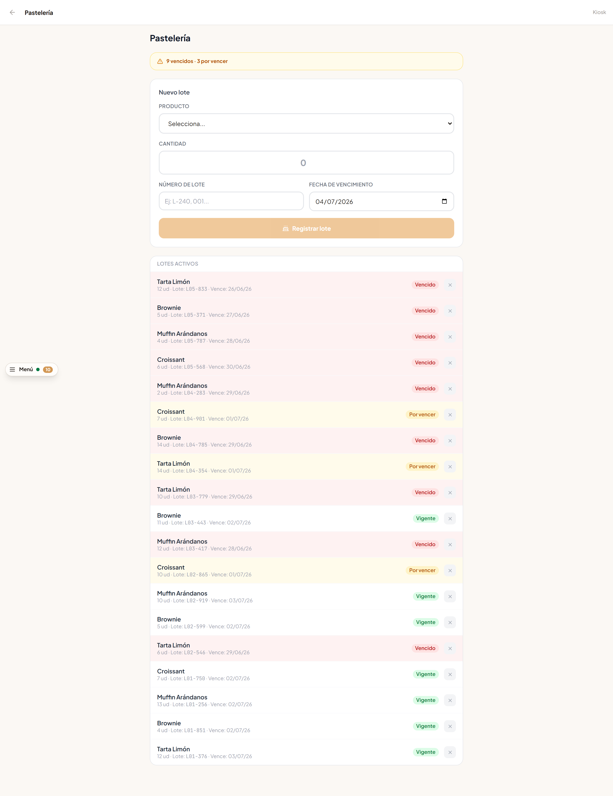

**Paso a paso**

Cómo registrar un lote:

1. En **Producto**, elija un producto de la categoría pastelería.
2. Escriba la **Cantidad**.
3. Escriba el **Número de lote** y la **Fecha de vencimiento** (viene sugerida a 3 días).
4. Toque **Registrar lote**.

Cómo revisar y cerrar lotes:

1. En **Lotes activos** verá cada lote con su cantidad, lote, vencimiento y estado.
2. Arriba se avisa si hay lotes **vencidos** o **por vencer**.
3. Para dar por terminado un lote, toque su botón de cerrar (**X**) y confírmelo.

**Consejos / notas**

- Registre los lotes al momento de producir/recibir la pastelería para que las alertas de vencimiento y la sección "Pastelería por impulsar" funcionen bien.

---

## 21. Limpieza semanal

**Para qué sirve.** Marcar las tareas de limpieza por **semana del mes** y ver quién las hizo y cuándo.

**Cómo llegar.** Botón **Menú → sección "Registrar" → Limpieza**.

**Requisitos.** Sesión activa.

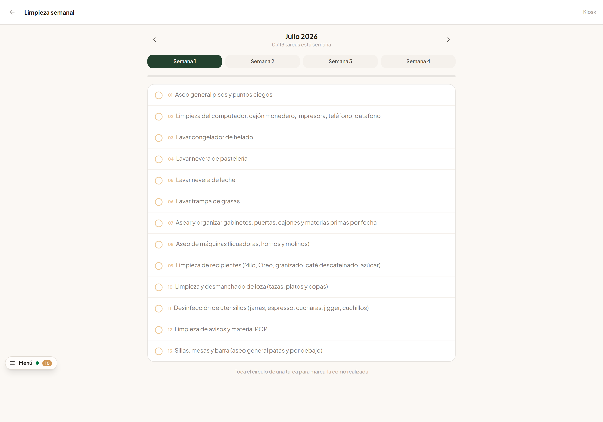

**Paso a paso**

Cómo marcar una tarea:

1. Navegue el **mes** con las flechas ‹ ›.
2. Elija la **semana** (1 a 4).
3. Toque el **círculo** a la izquierda de una tarea para marcarla como realizada.
4. La tarea marcada muestra quién la hizo y la fecha, y aparece la barra de progreso de la semana.

Cómo eliminar un registro propio:

1. En una tarea que usted marcó, use el botón de eliminar para quitar el registro.

**Consejos / notas**

- El **VoBo** (visto bueno) lo da el administrador; el barista solo marca la tarea como hecha.

---

## 22. Entrada y salida de barista (relevos en el POS)

**Para qué sirve.** Registrar los relevos durante el turno: sumar una barista que **entra** o registrar la barista que **sale**, siempre con su cuadre de caja. Si sale la **última** barista, se inicia el cierre del turno.

**Cómo llegar.** En el POS, dock inferior → **Entrada** o **Salida**.

**Requisitos.** Turno activo.

**Paso a paso**

Cómo registrar la entrada de una barista:

1. En el dock, toque **Entrada**.
2. Elija la barista que entra (solo aparecen las que no están ya en el turno).
3. Toque **Siguiente — cuadre de caja**.
4. **Cuente el efectivo**, escriba las **ventas tarjeta Bold** y adjunte la **foto de comprobante** (obligatoria).
5. Toque **Confirmar entrada y cuadre**. La barista queda sumada al turno.

Cómo registrar la salida de una barista (no es la última):

1. En el dock, toque **Salida**.
2. Marque quién(es) termina(n) su turno.
3. Toque **Siguiente — cuadre de caja**.
4. Cuente el efectivo, registre el Bold y adjunte la foto obligatoria.
5. Toque **Confirmar salida y cuadre**. El sistema indica quién continúa el turno.

Cómo registrar la salida de la última barista (inicia el cierre):

1. En el dock, toque **Salida** y marque a la última barista.
2. El sistema avisa que es la última y el botón cambia a **Iniciar cierre del turno**.
3. Tóquelo: pasa directamente al **Conteo de cierre** (sección 24) y, luego, a la **Salida de efectivo** (sección 26).

**Consejos / notas**

- Cada entrada y salida deja un cuadre de caja con foto: es la forma de tener claridad de cuánto había en caja en cada relevo.

---

## 23. Entrega de turno

**Para qué sirve.** Hacer un **cuadre de caja de entrega** en 3 pasos (efectivo, verificar Bold, foto) **sin cerrar el turno**. Sirve para dejar registrado el estado de la caja en una entrega intermedia.

**Cómo llegar.** Se alcanza por el flujo interno de turno. No figura como botón fijo en el menú.

**Requisitos.** Turno activo.

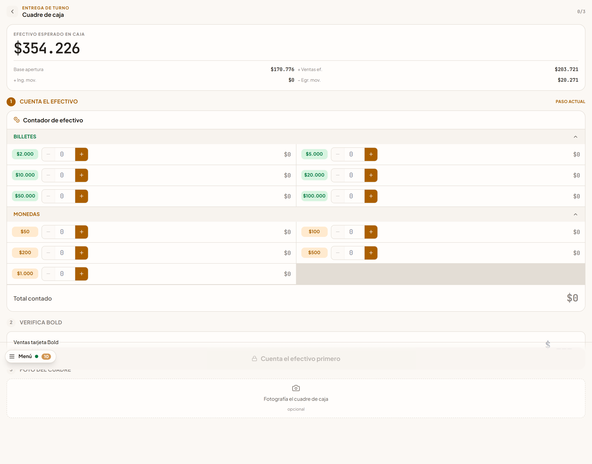

**Paso a paso**

Cómo registrar la entrega:

1. **Paso 1 — Cuenta el efectivo:** cuente los billetes y monedas. El sistema muestra la **diferencia** frente al efectivo esperado.
2. **Paso 2 — Verifica Bold:** escriba el total de **ventas tarjeta Bold**. Se muestra la diferencia frente al sistema.
3. **Paso 3 — Foto del cuadre:** fotografíe el cuadre de caja (este paso es opcional).
4. Toque **Registrar entrega**.

**Consejos / notas**

- La entrega **no cierra** el turno; solo deja constancia del estado de la caja. Para cerrar el día, use el flujo de cierre (secciones 24 a 26).

---

## 24. Conteo de cierre

**Para qué sirve.** Registrar el conteo físico del inventario **al finalizar** el turno, comparándolo con el sistema, antes del cuadre y cierre. Es el **Paso 4 de 5**.

**Cómo llegar.** **Gestión de turno → Conteo de cierre**, o automáticamente cuando sale la última barista (**Salida → Iniciar cierre del turno**).

**Requisitos.** Turno activo.

**Paso a paso**

Cómo hacer el conteo de cierre:

1. Escriba la **cantidad real** de cada producto (o use el control de **nivel de envase** para fraccionables).
2. Puede usar **Todo coincide con sistema** si contó y todo coincide (confirmando el aviso).
3. Toque **Confirmar y continuar al cierre**.
4. El sistema lo lleva al **cuadre final**: a **Salida de efectivo** si viene del flujo de kiosko, o a **Cierre de turno** en el flujo estándar.

**Consejos / notas**

- Igual que en la apertura, use el atajo "Todo coincide con sistema" solo si de verdad contó; de lo contrario, oculta faltantes.

---

## 25. Cierre de turno

**Para qué sirve.** Hacer el **cuadre de caja completo** y **cerrar definitivamente** el turno: contar el efectivo por denominación, registrar el datáfono Bold, ver el monto a consignar, adjuntar la foto obligatoria y justificar diferencias. Es el **Paso 5 de 5**.

**Cómo llegar.** Es el paso siguiente al conteo de cierre en el flujo estándar. Si falta el conteo de cierre, el sistema lo devuelve a esa pantalla.

**Requisitos.** Turno activo con conteo de cierre hecho.

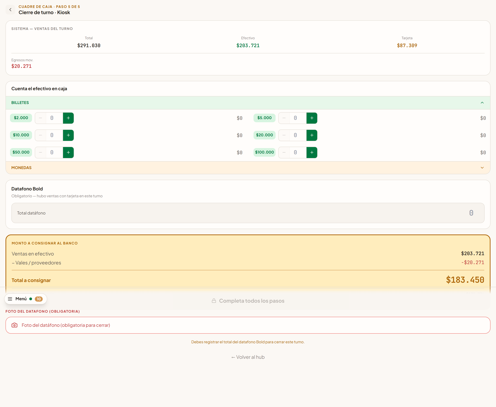

**Paso a paso**

Cómo contar el efectivo:

1. En **Cuenta el efectivo en caja**, despliegue **Billetes** y **Monedas** y escriba **cuántos** hay de cada denominación. El sistema calcula el total contado.
2. Compare el **Total contado** con el **Esperado sistema**.

Cómo registrar el datáfono y ver el cuadre:

1. Escriba el **Total datáfono** (Bold). Es **obligatorio** si hubo ventas con tarjeta en el turno.
2. En **Resultado del cuadre** verá si el **efectivo** y la **tarjeta** cuadran o tienen diferencia.
3. En **Monto a consignar al banco** verá cuánto debe consignar y qué **base** queda en la caja.

Cómo completar y cerrar:

1. Toque el botón de **Foto del datáfono (obligatoria)** y adjunte la foto.
2. Si hay diferencias, escriba la **Justificación de diferencias** (obligatoria cuando algo no cuadra).
3. Toque **Cerrar turno**.
4. Confirme en la ventana **¿Cerrar turno?** con **Sí, cerrar turno**. La acción es **irreversible**.
5. El turno queda cerrado, el dispositivo se desactiva y la aplicación vuelve al inicio.

**Consejos / notas**

- La **foto del datáfono** y la **justificación** (si hay diferencias) son obligatorias: sin ellas el botón no permite cerrar.
- Después de cerrar, recuerde **consignar** el efectivo (sección 13).

---

## 26. Salida de efectivo (cierre en kiosko)

**Para qué sirve.** Es el **cuadre final** cuando el cierre se inició desde el POS al salir la última barista: contar el efectivo, registrar el datáfono Bold, adjuntar la foto y **cerrar el turno** (lo que desactiva el dispositivo). Es el **Paso 2 de 2** del cierre en kiosko.

**Cómo llegar.** Es el paso siguiente al **Conteo de cierre** cuando este vino del flujo de kiosko (por "Iniciar cierre del turno").

**Requisitos.** Turno activo con conteo de cierre hecho.

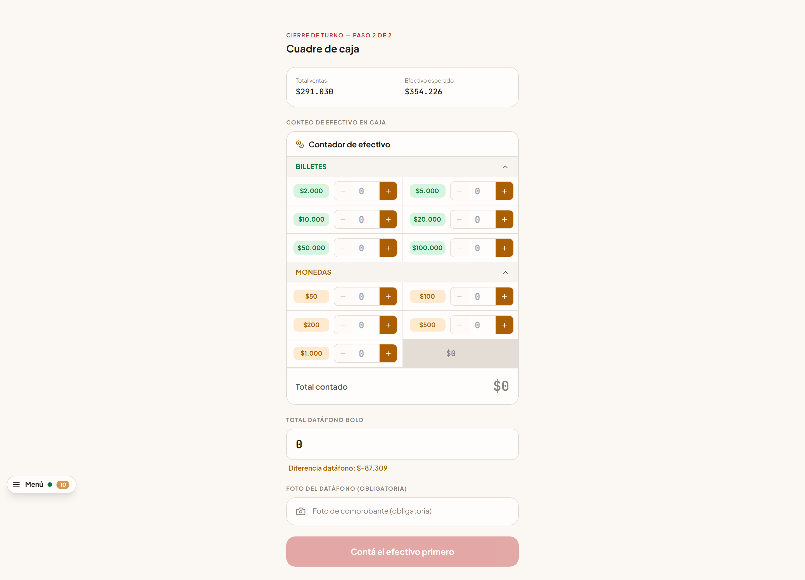

**Paso a paso**

Cómo cerrar el turno desde el kiosko:

1. En **Conteo de efectivo en caja**, cuente los billetes y monedas. Se muestra la **diferencia** frente al esperado.
2. En **Total datáfono Bold**, revise o corrija el valor (viene pre-llenado con el total de tarjeta). Se muestra la diferencia.
3. Toque el botón de **Foto del datáfono (obligatoria)** y adjunte la foto.
4. Toque **Revisar y cerrar turno**.
5. En la pantalla de confirmación revise los montos y las diferencias (si las hay).
6. Toque **Sí, cerrar turno**. El turno se cierra, el dispositivo se desactiva y la aplicación vuelve a **Activar caja**.

**Consejos / notas**

- Es un cierre equivalente al de la sección 25, pero pensado para cuando sale la última barista desde el POS. Ambos requieren efectivo contado + foto obligatoria.

---

## 27. Preguntas frecuentes

**No puedo entrar al POS, aparece bloqueado.**
El turno todavía no está **operativo**. Vaya a **Gestión de turno** y complete lo que falte: primero el **Conteo de apertura** y luego el **Cuadre de apertura** (con foto). Cuando ambos estén hechos, se habilita **Ir al POS**.

**Olvidé consignar el efectivo del cierre anterior.**
No se pierde: el sistema lo arrastra como **pendiente**. Vaya a **Menú → Herramientas → Consignaciones**, verá el monto **Por consignar**; registre la consignación con la foto del comprobante. Si ya abrió un turno nuevo, el efectivo esperado de apertura ya incluye ese pendiente.

**Conté mal un stock, ¿cómo lo corrijo?**
En **Inventario**, toque **+** o **−** en el producto, elija **ajuste** y escriba el número correcto. El **ajuste FIJA el stock** al valor que escriba (no suma ni resta). Escriba un motivo para dejar constancia.

**¿Cómo cambio quién está vendiendo?**
En la cabecera del POS, toque el selector con el nombre (**"[nombre] ▾"**) y elija la barista correcta. A partir de ahí, las ventas y registros quedan a su nombre. Si solo hay una barista en el turno, no hay opción de cambio.

**¿Qué pasa si intento cerrar sin cuadrar o sin foto?**
El sistema no deja cerrar. El botón **Cerrar turno** (o **Revisar y cerrar turno**) permanece deshabilitado hasta que cuente el efectivo, registre el datáfono Bold (si hubo tarjeta), adjunte la **foto obligatoria** y, si hay diferencias, escriba la **justificación**.

**El cliente paga una parte en efectivo y otra con tarjeta.**
En la ventana **Cobrar**, elija el método **Mixto** y escriba cuánto va en efectivo y cuánto en tarjeta. Los dos montos deben sumar exactamente el total.

**Se cortó la impresión o necesito otra copia del ticket.**
Para el último ticket, toque **Reimprimir** en la cabecera del POS. Para uno anterior, vaya a **Menú → Herramientas → Ventas** (Historial de ventas), busque el ticket, ábralo y toque **Reimprimir ticket**.

**Llegó mercancía nueva.**
Use **Menú → Herramientas → Recibir** (o el dock del POS). Elija el proveedor, escriba el total de la factura, agregue los productos con su cantidad y registre. Esto **suma stock** automáticamente. Lote y vencimiento se llenan solo si el proveedor los trae.

**Recibí un traslado desde otra sede.**
Vaya a **Mermas**. En **Traslados por recibir**, toque **Recibido** en la línea correspondiente; recién ahí se suma a su inventario.

**Terminó mi turno y entra otra persona.**
Si es un relevo, use **Salida** (para quien sale) y **Entrada** (para quien entra) en el dock del POS, cada una con su cuadre. Si es el fin del día y usted es la última, **Salida** iniciará el cierre completo del turno.

---

## 28. Glosario

- **Turno.** Período de trabajo de la caja. Se abre (con tipo, baristas y base), se opera y se cierra. Todas las ventas y movimientos quedan asociados a un turno.
- **Apertura / Cierre.** Momentos del turno. La **apertura** desbloquea la venta (conteo + cuadre de apertura); el **cierre** finaliza el turno (conteo + cuadre de cierre).
- **Cuadre.** Verificación de la caja: comparar el efectivo contado y las ventas de tarjeta con lo que el sistema espera, y dejar constancia (foto y, si hay diferencias, justificación).
- **Base de caja.** El efectivo con el que arranca la caja (lo que queda para dar cambio). En la apertura se cuenta y en el cierre queda como base para el día siguiente.
- **Consignación / consignar.** Depositar en el banco el efectivo de las ventas pendiente de los cierres, registrándolo en el sistema con el comprobante bancario.
- **Sencilla.** Cambio (billetes y monedas de baja denominación) que se solicita al administrador para poder dar vueltos.
- **Merma.** Baja de inventario por **consumo** o **daño**. También incluye los **traslados** de producto entre sedes.
- **Datáfono Bold.** El terminal de pago con tarjeta. En los cuadres se registra el total que muestra el datáfono para compararlo con las ventas de tarjeta del sistema.
- **Fraccionable / a granel.** Producto que se maneja por envase (bolsa o botella) y puede quedar a medias. Al contarlo se indica cuántos envases sellados hay y qué tan lleno está el abierto (**nivel de envase**).
- **Sede.** Cada local o punto de la cafetería. El dispositivo se vincula a una sede al activarse.
- **PIN de sistema.** Clave de la tienda que activa el dispositivo en modo kiosko. Activa la caja, no a la persona.
- **Barista activa.** La persona seleccionada en el selector del POS como responsable de las acciones en ese momento. Como el dispositivo es compartido, cada venta y registro se atribuye a la barista activa.
- **Kiosko.** Modo de trabajo con dispositivo compartido, sin usuario ni contraseña por persona: se activa con el PIN de sistema y se atribuye cada acción a la barista activa.
- **POS.** Punto de venta: la pantalla donde se arma la cuenta y se cobra.
- **Turno operativo.** Estado del turno cuando ya se hicieron el conteo y el cuadre de apertura. Solo con el turno operativo se habilita el POS.
